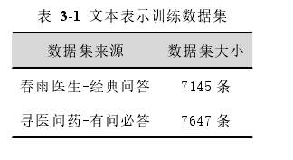
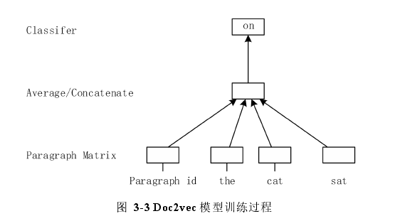
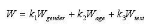

## 面向在线问诊平台的精准导医模型构建研究
- 将精准导医分为**科室预测**，**医患匹配**和**医生调度**三个阶段，以满足指导患者选择科室，为患者推荐合适医生的患者需求，以及为医生精准匹配医生，合理分配患者的医生需求
-
- 本文从在线问诊平台中获取 3300 名患者的基本信息，问诊文本和就诊科室信息，并将患者的基本信息和问诊文本输入特征表示模块，得到患者的特征向量
- 在最终匹配之前加入科室预测模块，一方面是由于患者一般是以科室医生这样的路径来进行挂号问诊，另一方面是由于医生数量众多，直接进行推荐匹配的精度和效率不高，因此本文首先利用分类技术实现科室预测，缩小后续医患匹配的范围，提高效率和精度。科室预测可以看作一个多分类问题，本文选择以线性支持向量机构造的多分类器解决多科室分类问题
- 本文从在线问诊平台中获取 3300 名患者的基本信息，问诊文本和就诊科室信息，并将患者的基本信息和问诊文本输入特征表示模块，得到患者的特征向量
- 首先采用文本表示技术对患者的咨询文本数据进行向量化，然后将性别年龄特征和文本向量特征分配一定的权重进行合成，在模型的训练过程中对权重参数进行调整。本文基于**Doc2vec**模型实现句子段落级的咨询文本的向量化表示。Doc2vec 能够从未标记的文本数据中学习单词和段落文本的向量表示，不仅能够保留单词的语义，还考虑到了单词顺序.基于Doc2vec 的文本表示模型可以分为模型训练过程和推断过程。模型训练过程就是通过训练数据集得到词向量、段落向量和 softmax 的参数，模型训练过程只需要一次，之后只需直接利用训练好的模型来获得所需的段落文本向量，即推断过程。
- Doc2vec 模型有两种训练方式，*Distributed Representations of Sentences and Documents[C]. Proceedings of the 31st International Conference on International Conference on Machine Learning, 2014, 32(2): 1188-1196.）*   PV-DM 模型是通过上下文单词和所在段落, PV-DBOW 
  则是直接利用段落向量来预测段落词语的向量表示进而训练得到准确的段落向量表示。对于大多数任务，PV-DM方法表现出更好的性能，但一般情况下将两种训练方式结合所得到的向量表示结果更为准确。本文抓取了多个在线问诊平台的问诊文本作为训练数据
- 
- 然后将分词后的段落文本作为输入数据，模型会为每个段落分配一个段落向量表示，为每个单词分配一个词向量表示，在不同段落中的相同单词其词向量表示是一致的
- 
- 矩阵 D 表示了各段落向量，矩阵 W 表示了各词向量。模型训练的初始环节，将随机初始化矩阵 D 和矩阵 W。在每次训练时，会随机抽取一个单词作为目标词，通过一个Softmax 
  分类器输出预测词。通过模型训练，即可以得到训练文本中各个单词的词向量表示以及各段落的段落向量表示，同时固定了 Softmax 分类器的参数和隐藏层的权重值，用于推断过程中新的段落文本的向量表示计算
- 推断过程和训练过程类似，首先在待推断段落文本中随机抽取一个单词作为目标词，然后将初始化的段落向量和预测词上下文的单词向量作为输入层，利用加权权重 h 计算得到隐藏层向量，然后再用已知参数 b 和 U 的softmax 分类器得到预测词。不断迭代该过程，在迭代过程中，词向量矩阵 W 和参数 b，U，h 的值均不变，只改变段落向量的值，使得目标函数（见公式）最大化。经过多轮迭代即可得到所需要预测的段落的向量表示，如表 3-2，得到问诊文本最终的向量化表示结果，以 200 维向量呈现。
- 如果将文本向量和年龄性别特征直接输入，高维的文本向量将会发挥主要作用，使得性别年龄特征的作用被掩盖,本文的策略是将患者的性别和年龄特征扩充复制为和文本特征同纬度的向量，比如性别特征为 1，扩展为 200 
  维的变量[1,1,…,1]，然后通过线性加权对三个特征向量进行求和 
- 其中 k1、k2、k3 为各特征对应的权重，初始化为 1, 而患者的特征表示模块是作为一个预处理环节镶嵌在后续的科室预测和医患匹配模块之中的，因此，可以利用后续环节的目标函数来对权重 k1、k2、k3 进行最优化，保证模型输出和真实数据之间的误差最小
- 本文综合了患者对医生擅长疾病的考虑以及患者进行选择决策时的其他因素，得到医生的综合得分，根据得分高低为患者提供推荐列表。也就是说，匹配算法的医生最终得分由医患相似度得分和决策因素得分两部分综合组成
- 医生 Di 和测试患者 P 之间的相似性 sim(Di,P)为测试患者 P 和医生最近诊疗的 5 位患者之间的相似度的最大值，称为医患相似度
- 医生特征表示除了诊疗特征之外，还有与患者就医决策相关的基本特征，这一部分特征与患者需求的匹配度是提高导医精准度的重要部分，能够更好的满足患者的实际需求。包括了医生问诊价格，收到的心意数，微信关注人数，好评率以及同行认可比例.
- 本文通过计算各医生和**患者历史选择医生**之间的相似度表示候选医生在决策因素特征上的得分
- 对于首次问诊的新用户，尚未有过诊疗记录，因此没有对应的历史选择特征。对于首次问诊的患者，本文基于协同过滤的思想，计算患者之间的相似度，根据相似患者的历史选择数据来计算候选推荐对象的决策因素得分，对于第一次进行线上问诊的测试患者 P，首先计算该患者和所有线上问诊用户之间的相似度，得到与测试患者最相似的患者 PS,得到最近似患者 PS 后，以患者 PS 的历史问诊治疗记录来计算各候选医生对于患者 P 决策因素相似度
- 所得到的推荐对象倾向于诊疗能力高，口碑、价格、资历更符合大众需求的医生，这就可能导致部分医生负荷过载，因此本文提出基于***稳定匹配理论***实现医生的合理调度，均衡医生分配
-
- #面向智能导诊服务的个性化医生推荐与应用
-
-