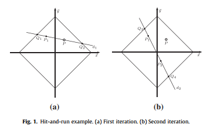

- [[Stochastic multiobjective acceptability analysis for the Choquet integral preference model and the scale construction problem]]
- 这篇文章将肖凯积分和那个SMAA结合了
-
- combine the Choquet integral preference model with the SMAA methodology in order to get robust recommendations taking into account all parameters compatible with the preference information provided by the Decision Maker (DM).
- 这篇文章没有用到蒙特卡罗模拟的方法，他是用到一个HAR sampling的方法 
- 结合之后和普通的SMAA的区别是决策者可以更灵活的表达自己在某些属性权重上的偏好，这篇文章用到是2-additive的choquet integral，当从方案评价矩阵sampling 之后，会产生一个特定的 compatible constrated set对应于choquet integral的capacity,每个评价矩阵的样本对应的compatible constraied set是不一样的，所以会筛选一个特定的capacity.
- 这篇文章还对不同属性评价信息的尺度不一样提供了解决思路是先从[0,1]区间中随机产生样本，个数是方案的总个数，然后按照顺序将随机产生的样本分配给不同方案来替代原先不一样的尺度，每次产生样本这样就使原先确定的评价信息转换为了不确定的评价信息
- [[Algorithms for interval-valued fuzzy soft sets in stochastic multi-criteria decision making based on regret theory and prospect theory with combined weight]]
- 看这篇文章主要就是看他的regret theroy 和prospect theroy
- 他这个regret theroy是采用加总的方式计算的，即计算某个方案相对于所有其他的方案的后悔值的加总
- prospect theroy就是有个参照点的有效用函数的，这里参考今天记的onenote