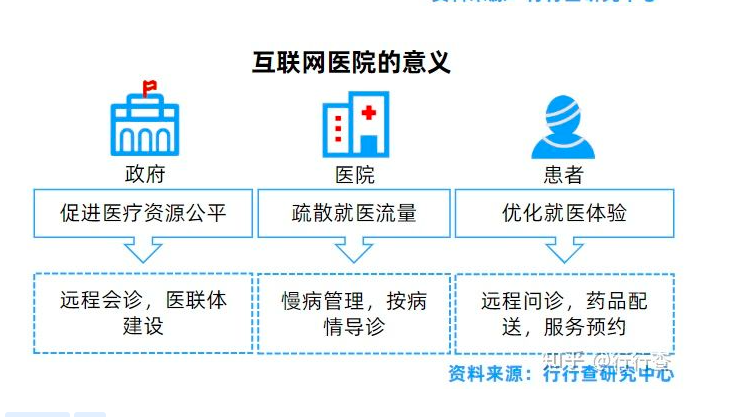

- https://baijiahao.baidu.com/s?id=1714374972843276068&wfr=spider&for=pc
#### 在线医疗
- [[Effects of Online–Offline Service Integration on e-Healthcare Providers: A Quasi-Natural Experiment]]
- 该研究首次在在线医疗领域探索了线上线下渠道整合的影响，验证了线上线下渠道整合对不同类型医生的异质性作用
- 医院医疗资源短缺、医生工作负荷超载、患者排队时间增加等民生问题日益突出，我国医疗系统管理面临新的挑战，而在线医疗平台成为应对这一挑战的重要途径之一。为了优化患者服务体验、提高医生工作效率，在线医疗平台开始整合其线上问诊渠道和线下就医渠道，通过渠道整合，医生可以更方便地进行在线问诊、安排线下就诊，并且同步患者相关的医疗病历。为了厘清渠道整合与医生问诊量和社会声誉之间的相互作用机理，进而为有效地解决医疗问题和缓解医疗压力提供决策建议和管理支撑，颜志军教授团队耗时8个月的时间共收集了三万多位医生的面板数据并开展了相关实证研究。
- 研究发现，在线医疗平台进行**线上线下渠道整合能够增加医生的线上渠道问诊量**，但是会削减医生的线下渠道就诊量。具体而言，线上线下渠道整合打破了时间和空间的限制，使得患者可以随时随地进行线上问诊，从而提高了医生的在线问诊量。同时，对于病情不严重、无需去医院就诊的患者，医生会提供线上建议，帮助其病情恢复，**进而有助于缓解医院医疗资源短缺的问题**。此外，研究还揭示了渠道整合对不同职称和不同疾病类型医生的调节作用，**发现渠道整合正向调节低职称医生和慢性病医生的问诊量和社会声誉，这表明渠道整合有利于帮助解决新手医生的“冷启动”问题。**
- https://zhuanlan.zhihu.com/p/420507532
- 
-