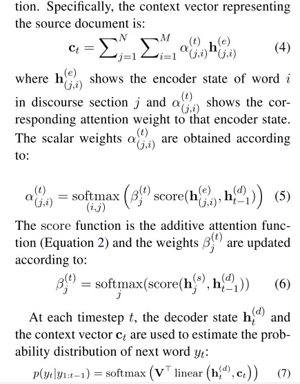

- https://github.com/acohan/long-summarization
- 
- 他这个结构跟普通的seq2seq的区别就是他是层级式的解码，最终的注意力是关注到所有的token级别的，但是不同的section部分的token会乘上这个section部分独有的权重，就是下面这三个公式的样子
- 
- 他这里也用到了copying 机制
- 
- 他这篇文章是专注于做scientific paper summarization的，他认为哪些news article跟这些学术文献相比还是太短了，
- 它使用的数据是arxiv和pubmed上取下来的
- We also introduce two large-scale datasets of long and structured scientific papers obtained from arXiv and PubMed to support both training and evaluating models on the task of long document summarization.
- 他这个训练的label就是每篇文章的abstract
- {:height 272, :width 426}
- 去掉太长的文章，就比如学位论文，设置最大长度为2000，词典大小5000，还有其他的一些预处理，只是用level 1级别的section name，把表格和图片去除，把公式和数学符号还有引用标记全部用特殊符号代替，然后只保留conclusion及以上的section部分，reference部分的文本不要
- 用到的文本预处理工具spacy
- We remove the documents that are excessively long (e.g., theses) or too short (e.g., tutorial announcements), or do not have an abstract or discourse structure. We use the level-1 section headings as the discourse information. For arXiv, we use the LATEX files and convert them to plain text
- In particular, we use two bidirectional LSTMs with cell size of 256 and embedding dimensions of 128. Embeddings are trained from scratch and we did not find any gain using pre-trained embeddings. The vocabulary size is constrained to 50,000; using larger vocabulary size did not result in any improvement. We use mini-batches of size 16 and we limit the document length to 2000 and section length to 500 tokens, and number of sections to 4. We use batch-padding and dynamic unrolling to handle variable sequence lengths in LSTMs.
-
- 这篇文章最后还把自己和几个抽取式和生成式的摘要模型做了对比