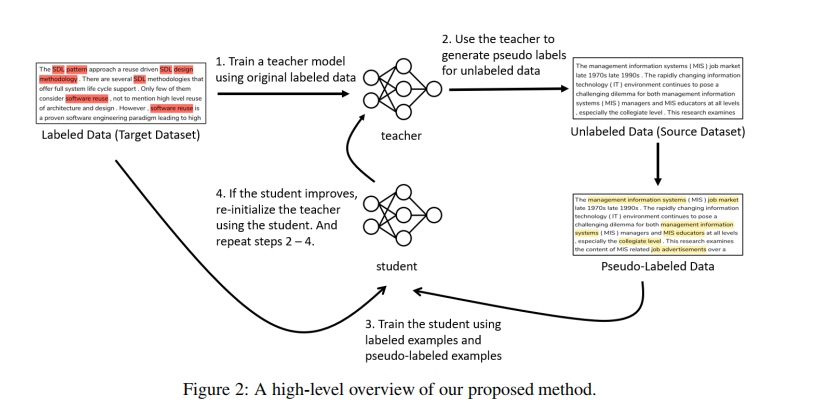
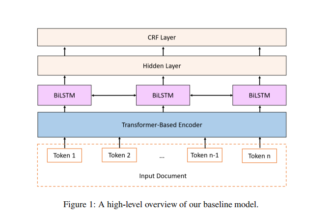

- 
- In this work, we employ the BiLSTM-CRF architecture as the baseline architecture
- Figure 1 shows a high-level overview of our baseline model.
- 
- Given a sequence of input tokens, the model first forms a contextualized representation for each token using a Transformer-based encoder. The model then further uses a bidirectional LSTM (Hochreiter and Schmidhuber, 1997) on top of the Transformer-based representations. After that, a dense layer is used to map the output of the bidirectional LSTM to the label space. Finally, a linear-chain CRF is applied to decode the labels.
- A better teacher will generate more accurate pseudo-labels, which in turn helps train a better student. And then the improved student will be used to re-initialize the teacher
- To the best of our knowledge, the only other work exploring self-learning for keyphrase extraction is that of Zhu et al. (2020). However, during each training epoch, their method needs to label all unlabeled examples and then selects the ones with **high confidence scores.** This would incur a lot of overhead for every single training epoch as the number of unlabeled examples is typically very large.