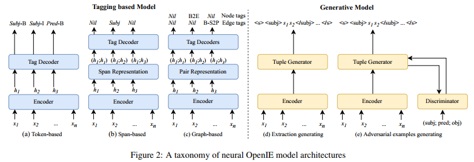
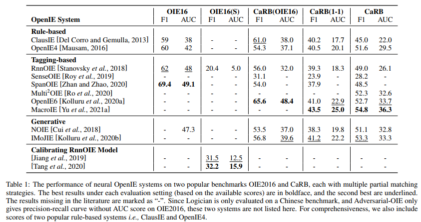

title:: A Survey on Neural Open Information Extraction: Current Status and Future Directions

- 目前的基于神经网络的开放信息抽取确实提出了一些模型
- 开放信息抽取式schema free式的抽取形式，预先没有定义任何形式的relation
- 输入是给定一段文本$S = ⟨w_1, w_2, . . . , w_n⟩$，模型需要输出一个元组列表$T_1, T_2, . . . , T_p$，每个元组$T_{i} = ⟨a_{i1}, p_{i}, a_{i2}, ..., a_{iq}⟩$包含一个主语，一个谓词，一个或多个宾语
-
- 架构方面没什么特殊的，问题的建模形式方面这篇文章是把他分为了tagging-based model和generative based model
- 
- 
- 目前的开放信息抽取多是基于句子级别，很少基于多个句子或者篇章级别，
- 存在的问题
	- 现有的基于神经网络的开放信息抽取模型都是基于已有的那几个数据集的，那几个数据集的涵盖领域有限，数量较少，开放信息抽取的数据集的标注非常困难，不同的标注者对于什么信息该抽取什么该忽略没有同一的标准
	- 已有的基于神经网络的开放信息抽取模型抽取出来的结果非常繁杂，质量很差，几乎没法用到下游应用中，
	- 鉴于全开放的信息抽取结果较差，有人提出半开放的信息抽取，让抽取的结果更聚焦于某个主题，semi-open information extraction,即指定一个topic来做开放信息抽取
	- nerual-based oie收到数据集的制约非常明显，在某些问题上，rule-based 真的不必nerual-based的差
-
-
-
-
-
-
-
-
-
-
-
-
-
-
-
-
-
-
-