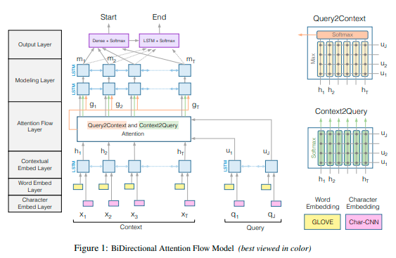
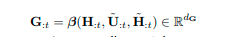

- In this paper we introduce the Bi-Directional Attention Flow (BIDAF) network, a multi-stage hierarchical process that represents the context at different levels of granularity and uses bidirectional attention flow mechanism to obtain a query-aware context representation without early summarization
-
-
- Bi-directional Attention Flow (BiDAF) network is a multi-stage hierarchical process that represents context at different levels of granularity and uses a bi-directional attention flow mechanism to achieve a query-aware context representation without early summarization.
- In this paper, we introduce the Bi-Directional Attention Flow (BIDAF) network, a hierarchical
  multi-stage architecture for modeling the representations of the context paragraph at different levels of granularity
-
-
-
- Second, we use a memory-less attention mechanism. That is, while we iteratively compute attention through time as in Bahdanau et al. (2015), the attention at each time step is a function of only the query and the context paragraph at the current time step and does not directly depend on the attention at the previous time step. We hypothesize that this simplification leads to the division of labor between the attention layer and the modeling layer. It forces the attention layer to focus on learning the attention between the query and the context, and enables the modeling layer to focus on learning the interaction within the query-aware context representation (the output of the attention layer). It also allows the attention at each time step to be unaffected from incorrect attendances at previous time steps. Our experiments show that memory-less attention gives a clear advantage over dynamic attention. Third, we use attention mechanisms in both directions, query-to-context and context-to-query, which provide complimentary information to each other.
- 
- Finally, the contextual embeddings and the attention vectors are combined together to yield G, where each column vector can be considered as the query-aware representation of each context word. We define **G** by
- 
- While the β function can be an arbitrary trainable neural network, such as multi-layer perceptron, a simple concatenation as following still shows good performance in our experiments
-
-
  >使用的数据集
- Our experimental evaluations show that our model achieves the state-of-the-art results in Stanford Question Answering Dataset (SQuAD) and CNN/DailyMail cloze test.