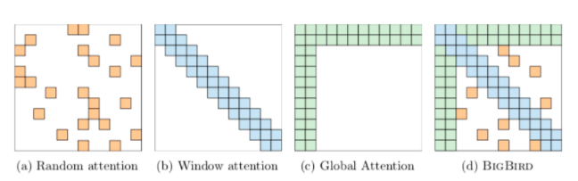
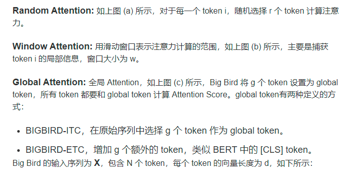

title:: Big Bird: Transformers for Longer Sequences

- https://huggingface.co/blog/big-bird
- 
- BigBird block sparse attention is a combination of sliding, global & random connections
- 上图是 Big Bird 稀疏注意力的示意图，主要包括三个部分的注意力：Random Attention (随机注意力)，Window Attention (局部注意力)，Global Attention (全局注意力)。这三部分注意力结合在一起就可以得到 Big Bird 注意力矩阵 A，如上图 d 所示。如果 A(i,j) = 1 则表示 token i 需要和 token j 计算注意力值
- 
- bigbird实现代码注释
- bigbird是按照从上到下一层一层计算attention matrix的
- 在代码中attention的计算是以block的方式进行的，主要的
- 第一个query block和最后一个query block是关注全局的，
- 中间的query block是attend到sliding window的，具体的计算方式是把key block sequence向左移一个单位，向右移一个单位，拼接着三个sequence,计算复杂度就变为O(3n)了，不再是原来的O(n*n)了
- random block也会concat到一起计算，也是线性复杂度，产生随机random block的时候会涉及到一个gather操作，每一行的random block的个数是确定的,这个计算的复杂度和sliding attention的复杂度差不多，每一行关注的额外的random block个数是相同的，所以就可以用和sliding attention相同的计算方式来计算
- 主要的实现attention的计算的在函数**bigbird_block_sparse_attention**中
- 在这个函数里面，他是把整个attention矩阵的计算分割成了5步来计算
	- query block 1
	- query block 2
	- middle query block
	- last second block
	- last first block
- 最后把这上面的五部分concat到一起就构成一个新的sequence representation了
- 他这个bigbird文中说用到seq2seq端的encoder时候，在做长文本总结的时候效果非常的好
- 这个代码中有**实现相对位置编码**
-
- **Pretraining and MLM** We follow to create base and large versions of BIGBIRD and
  pretrain it using MLM objective. This task involves predicting a random subset of tokens which have been masked out
-
-
-
-
-