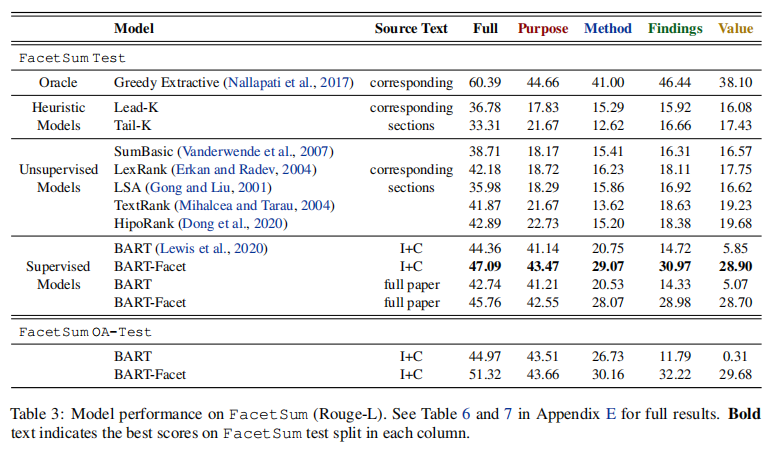

title:: Bringing Structure into Summaries:a Faceted Summarization Dataset for Long Scientific Documents

- 他在这篇文章里面是构建了一个数据集，这个数据集是用来做文献方面级摘要的，用的标注数据集是那种有结构化摘要的文献，共包含四个方面，目的，方法，发现
- It consists of 60,024 scientific articles collected from Emerald journals, each associated with a structured abstract that summarizes the article from distinct aspects including purpose,
  method, findings, and value
- each structured abstract in FacetSum is provided by the original author(s) of the article, who are arguably in the best position to summarize their own work
-
  >Four Facet
	- Purpose describes the motivation, objective, and relevance of the research
	- Method enumerates specific measures taken to reach the objective, such as experiment design, tools, methods, protocols, and datasets used in the study
	- Findings present major results such as answers to the research questions and confirmation of hypotheses
	- Value highlights the work’s value and originality
-
  >alignment
	- Specifically, we investigate how the abstract structure (i.e., facets aligns with the article structure
	- 这篇文章的作者还用rouge的方法计算了摘要中的四个部分与全文中的section和sentence部分对齐的情况，结果显示并不是完全对齐
-
  > Experiments and Results
	- 这篇文章用BART作为训练模型
	- 
	- In BART, we train the model to generate the concatenation of all facets, joined by special tokens that indicate the start of a specific facet
	- 他这个依然还是生成模型
	- In BART-Facet, we train the model to generate one specific facet given the source text and an indicator specifies which facet to generate他这里就是在每个输入前面加上facet提示词来告诉模型该总结哪个方面
	- 结果显示这个BART目前还不具备处理学术文本全文的能力,或者说处理学术文本全文的能力较差，他用introduction和conlusion部分的拼接作为输入文本的时候处理的效果还行，但是把全文作为输入效果就很差了
-