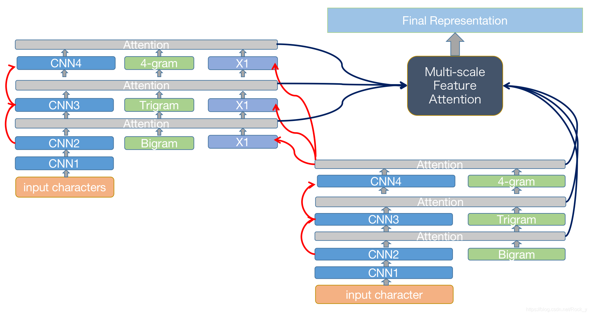
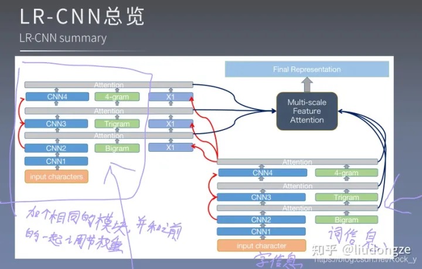

- 
- 
-
- 首先输入字符信息，经过CNN1，CNN2，和Bigram词信息用Attention进行融合，之后经过CNN3，和Trigram词信息进行融合，CNN4类似，最后输出最顶层Attention。这是属于一个模块，然后将这一模块复制一遍同时每层加入X1，也就是刚刚最顶层的Attention值，得到第二个模块的最顶层Attention之后，将每个模块每层的Attention值进行融合，以多尺度特征Attention的方式。融合之后得到最终的输入表示，输入到CRF层中。
  上面的过程还用到了一些tricks，比如残差连接，位置编码，在代码中有所体现。
-
-
-
-
-
- https://blog.csdn.net/Rock_y/article/details/109091990
-
-
-