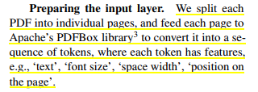
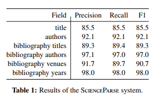

- The resulting literature graph consists of more than 280M(节点不全是paper) nodes, representing papers, authors, entities and various interactions between them (e.g., authorships, citations, entity mentions).
- We reduce literature graph construction into familiar NLP tasks (e.g., entity extraction and linking)
- The methods described in this paper are used to enable semantic features in www.semanticscholar.org
-
  >Structure of The Literature Graph
- 下面介绍他们构建的文献图谱的具体结构
-
  >node type
	- Papers:
	- Authors:
	- **Entities**:  Each node of this type represents a unique scientific concept discussed in the literature, with attributes such as ‘canonical name’, ‘aliases’ and ‘description’.
	- **Entity mentions**: Each node of this type represents a textual reference of an entity in one of the papers, with attributes such as ‘mention text’, ‘context’, and ‘confidence’.
	-
-
  background-color:: #497d46
  >edge type
	- Citations：就是文献之间的引用关系
	- Authorship：就是作者关系
	- **Entity linking edges**：We instantiate a directed edge from an extracted entity mention node to the entity it refers to. We encode a symmetric relation between
	  m1 and m2 as two directed edges $m_1 \rightarrow m_2$ and $m_2 \rightarrow m_1$.
	- **Mention–mention relations**：We instantiate a directed edge between a pair of mentions in the same sentential context if the textual relation extraction model predicts one of a predefined list of relation types between them in a sentential context.
	- **Entity–entity relations**：While mention–mention edges represent relations between mentions in a particular context, entity–entity edges represent relations between abstract entities. These relations may be imported from an existing knowledge base (KB) or inferred from other edges in the graph.
- 为了解析从各个数据源所获取到的文献的元数据metadata，他们构建了一个scienceparse的系统，有点类似与我以前看到的那个论文pdf解析器
- we built the ScienceParse system to predict structured data from the raw PDFs using recurrent neural networks (RNNs).2 For each paper, the system extracts the paper title, list of authors, and list of references; each reference consists of a title, a list of authors, a
  venue, and a year.
- 这个论文里有详细介绍了他们这个系统的训练方式
- 
- 他这个标注系统就是一个全连接加上双向lstm再加上一个全连接，然后用sequence labeling的方式进行解码
- 下面这张表展示了这个系统的准确率
- 
-
  >Entity Extraction and Linking
- we discuss how we populate mentions and entities in the literature graph using entity extraction and linking on the paper text. In order to focus on more salient entities in a given paper, we only use the title and abstract
- 对于实体标注和对齐，他这里只使用了标题和摘要数据
	- Entity Extraction Models
		- We use the BILOU scheme to encode labels at the token level. Unlike most formulations of named entity recognition problems (NER), we do not identify the entity type (e.g., protein,drug, chemical, disease) for each mention since the output mentions are further grounded in a KB with further information about the entity (including its type), using an entity linking module
		  id:: 6368ef72-c281-4f09-bb0f-8c5a22829d7e
		- 他训练的这个实体抽取模型也是专门在生物医学领域的训练集和计算机领域的训练集上进行训练的，对管理科学领域的训练效果非常的不好
	- Knowledge bases 他这里的实体抽取基于了两个已有的知识库, 一个是生物领域，一个是计算机领域
		- UMLS
		  background-color:: #533e7d
		- DBpedia
		  background-color:: #533e7d
	- Entity Linking Models
		- Given a text span s identified by the entity extraction model and a reference KB, the goal of the entity linking model is to associate the span with the entity it refers to.
		- A span and its surrounding words are collectively referred to as a mention. We first identify a set of candidate entities that a given mention may refer to. Then, we rank the candidate entities based on a score computed using a neural model trained on labeled data
		- 主要就是包含下面2步
			- Candidate selection
			- Scoring candidates
-
  >Other Research Problems
	- Limited KB coverage
		- Introduction of new concepts and relations in the scientific literature occurs at a faster pace than KB curation, resulting in a large gap in KB coverage of scientific concepts. In order to close this gap
		- 这个意思就是说目前的知识库的覆盖范围太小了，论文中的很多实体和关系在知识库中都没有，也就没法对齐，需要用到论文中出现的实体和关系去补充现有的KB，所以这篇论文中采用的方式就是远程监督的方式，利用论文中已有的实体和关系作为远程监督样本，来训练entity extraction 和relation extraction 模型
		- In short, we train two models for identifying entity definitions and relations expressed in natural language in scientific documents, and automatically generate labeled data for training these models using known definitions and relations in the KB
	- Author disambiguation
-
-
-
-
-