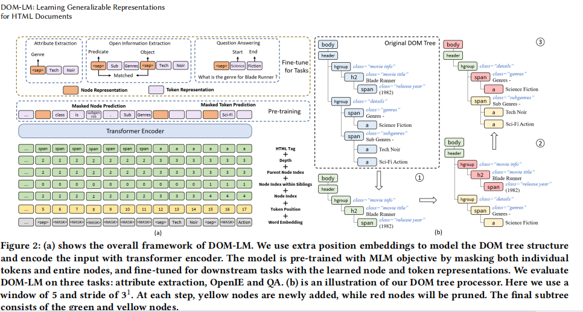

title:: DOM-LM: Learning Generalizable Representations for HTML Documents

- {:height 385, :width 704}
- we design an algorithm that splits a DOM tree into multiple subtrees such that surrounding nodes important for understanding the semantics of a target node appear in the same tree
- 这篇文章没有code