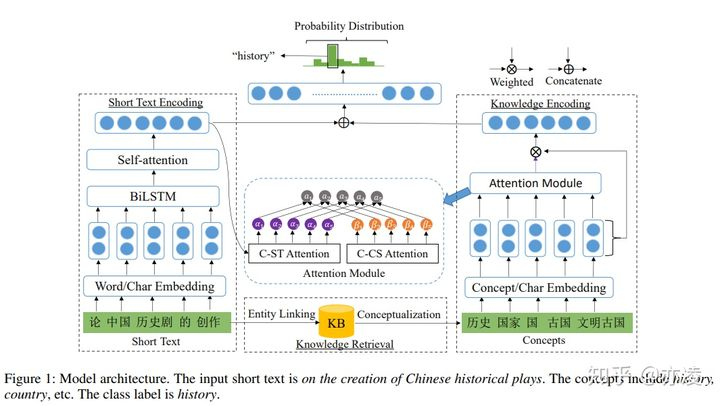

- 
- 这篇论文有代码的
-
  >（1）输入层 Input Embedding
- 输入层包含两部分：长度为n的短文本序列和长度为m的实体序列，使用的向量包括：character embedding, word embedding, and concept embedding，字符级别用的是CNN，词语和concept级别用的是预训练词向量。
-
  >（2）短文本编码 Short Text Encoding
- 此模块的作用在于计算短文本 X=(x1, x2, ..., xn)的句子表示 q。 在使用自注意力之前，论文添加了 BiLSTM 来转换底层的输入。 原因为： 注意力机制使用加权和来生成输出矢量，因此其表示能力受到限制。 同时，LSTM擅长捕获序列的上下文信息，可以进一步提高注意力网络的表达能力。
- LSTM输出之后，经过一个自注意力机制self-attention，注意力机制使用缩放点积注意力机制（scaled dot-product attention）
- 自注意力机制输出的矩阵表示为A，然后使用一层max pooling去获取句子的表示q，目的是在向量的每个维度上选择最大值以捕获最重要的特征。
-
  >（3）知识编码 Knowledge Encoding
- 给定大小为m的概念集C，表示为（c1，c2，...，cm），其中ci是第i个概念向量，需要得到其向量表示p。 论文使用了两种注意力机制（C-ST、C-CS），以更多地关注重要的概念。
-
  1. Concept towards Short Text (C-ST)
  C-ST用于计算短文本和对应的概念集合的语义相关性，减少由于实体的歧义或KB噪声而引入的一些不正确概念的不良影响.这个query向量就是短文本的向量表示本身short text representation q
-
  2. C-CS注意力机制
- 这个注意力机制的意思是说，作者希望更关注细粒度的概念，而不是较大的概念，这个计算注意力的方式好像是self-attention
- 本文提出了基于知识驱动的深度短文本分类方法。我们在KBs中整合概念信息来增强短文本的表示。为了测量每个概念的重要性，我们使用两种注意机制来自动获取用于生成概念表征的概念的权重。我们根据文本及其相关概念对短文本进行分类。最后，我们在4个不同任务的数据集上验证了我们的模型的有效性，结果表明它优于目前最先进的方法。
  我们发现，由于知识库的不完整性，一些在短文本中提到的实体缺乏概念。除了概念信息外，实体属性及其值也可以作为显式特征注入到深层神经网络中
-
  >论文的不足
- 1. AAAI的截稿大概是上一年的九月，论文成文的时候居然不试试BERT词向量，在embedding阶段可能就解决了不少问题了，ELMo等等的也没有尝试，比较遗憾。
- 2. 知识编码部分两个注意力出来的维度是不一样的，结合部分没有提到具体是怎么把两个维度不一样的矩阵弄成一样的，有点迷惑。
- 3. 两种注意力机制的结合部分，用一个独立的神经网络来实现参数调节，这个地方其实也相当于一种门机制？推测作者不是很想引入太多新的东西，所以在这个地方没提到这新概念。
- 4. 实验部分，不是讨论网络结构，加了个对于词向量是不是固定的探索实验，感觉不是很有必要。