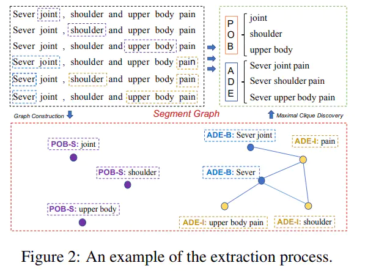
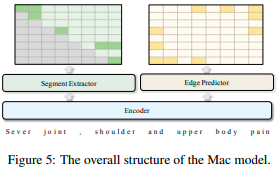

- 本篇论文是解决NER中细分任务：识别不连续的实体(Discontinuous Named Entity)。先前的方法主要采用分阶段的方式进行识别，但存在误差传递的问题。本文中，作者提出segment graph(片段图)的方法，图中每个节点(node)代表一个片段(segment)——这个片段可能独立组成一个实体，也可能是不连续实体的一部分，图中的边(edge)连接两个片段，代表属于同一个实体。这样就将不连续的实体识别问题转化成图中最大团发现的问题。
- 
- 这个是他们的模型MAC的结构
- 
-
-
-
-
-
-
-
-