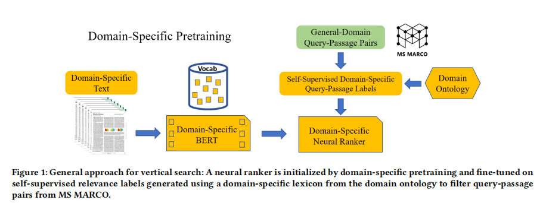
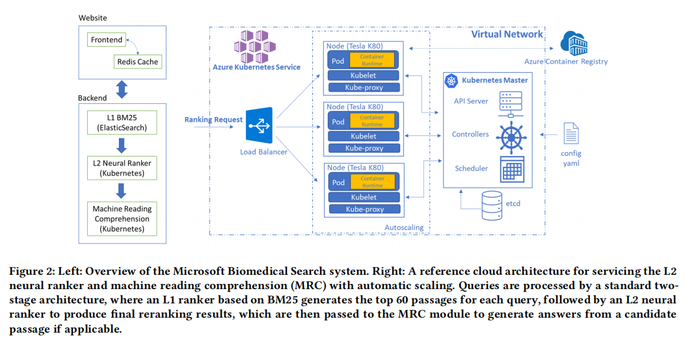

title:: Domain-Specific Pretraining for Vertical Search: Case Study on Biomedical Literature

- 
-
- 
- Such a cross-attention neural  model will not be scalable enough for the retrieval step, as we
  must compute, from scratch, for each candidate text with a new query.
- The standard practice thus adopts a two-stage approach, by using a fast L1 retrieval method to select top 𝐾 text candidates, and applying the neural ranker on these candidates as L2 reranking
- In our proposed approach, 
  background-color:: #497d46
- we use BM25 for L1 retrieval,
- and initialize our L2 neural ranker with a domain-specific BERT model. To fine-tune the neural ranker, we use the Microsoft Machine Reading Comprehension dataset, MS MARCO [26], and a domain specific lexicon to generate noisy relevance labels at scale using self-supervision.
- . For self-supervised fine-tuning labels, we use the MS MARCO subset [24] whose queries
  contain at least one domain-specific term from the domain ontology