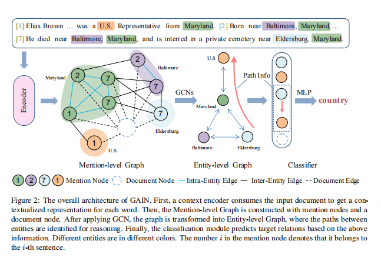
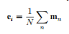
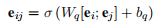
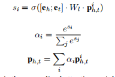
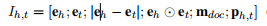
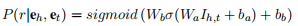

public:: true

- 
- 代码：https://github.com/PKUnlp-icler/GAIN
- 这篇文章提出来的目的是为了解决文档级关系抽取问题的，就是两个实体不是在一个句子里面的信息抽取问题
- 输入是一篇文档，和文档中的各个实体，然后对各个实体的关系进行分类，他这个关系抽取是封闭关系抽取问题，where R is a pre-defined relation type set. 然后这个实体间的关系也是分为两类的，一类是句子间关系，如果两个实体未在一个句子中出现过，一类是句子内关系，如果两个实体在一个句子内出现过
- GAIN mainly consists of 4 modules: encoding module, mention-level graph aggregation module, entity-level graph inference module, classification module
- Mention-level Graph Aggregation Module
	- node:every entity mention node, document node
	- edge:三种边
		- 相同的实体不同的提及会被连到一起，
		- 不同的实体如果同时出现在一个句子中会被连到一起
		- 所有的点都会连到总的文档节点
	- 最后用图卷积网络更新所有节点的表示
- Entity-level Graph Inference Module
	- mentions that refer to the same entity are merged to entity node so as to get the nodes in EG，融合提及的方式就是取平均
	- 
	- merge all inter-entity edges that connect mentions of the same two entities so as to get the edges in EG.
	- 
	- We also introduce attention mechanism, using the entity pair as query, to fuse the information of different paths between $e_h$ and $e_t$.
	- 
- Classification Module
	- For each entity pair $(e_h, e_t)$, the representation of document node in Mention-level Graph $m_{doc}$, the comprehensive inferential path information $p_{h,t}$ , we concatenate the following representations:
	- 
	- Finally, we formulate the task as multi-label classification task and predict relations between entities:
	- 
- [[论文信息抽取]]