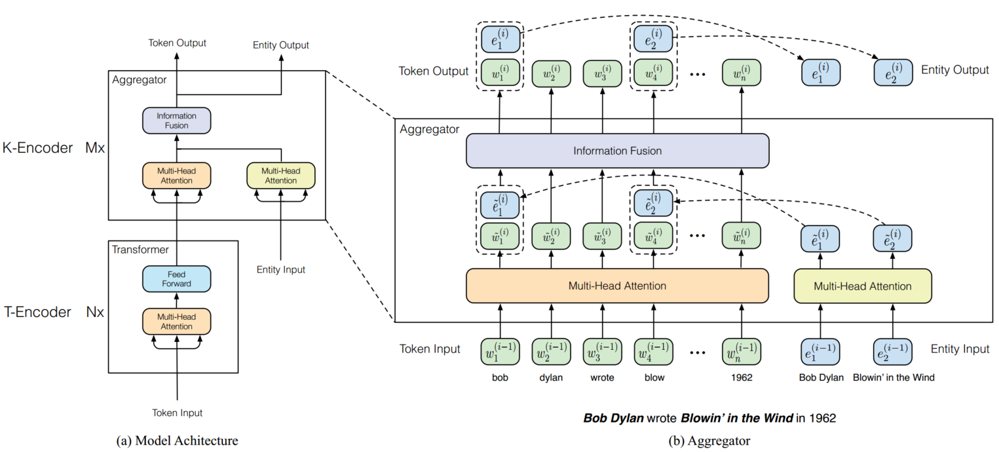
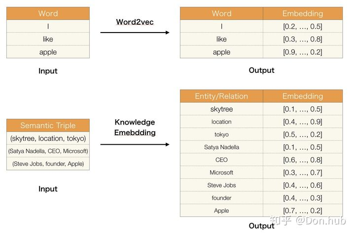

- 这篇是清华的ERINE
- 用的方法和百度的方法还是有一点区别的
- 本文中，我们基于BERT，利用语料库和KG训练了一个增强语言表征模型。
- 我们提出了基于信息实体的增强语言表征模型，该模型基于**大规模语料库和KG预训练语言表征模型**
- 1）为了抽取和编码知识信息，我们首先识别文本中的命名实体mention，然后将这些mention与KG中的实体相对齐。我们使用**TransE**这样的知识嵌入算法编码KG的图结构，而不是直接使用KG中基于图的事实，然后将信息实体嵌入作为ERNIE的输入。基于KG和文本的对齐，ERNIE将知识模型中的实体表征整合进了语义模型的底层中。经过信息融合，得到两种输出，Token output以及Entity output。
- 2）类似BERT，我们使用MASK和预测下一句NSP作为训练任务。此外，为了更好的融合文本和知识特征，我们设计了新的训练任务：随机mask输入文本中的实体对，并让模型从KG中选择合适的实体来完成对齐(Mask Entity Prediction)。与传统模型仅使用本地上下文信息预测token不同，我们的训练任务需要模型合并上下文和知识事实来预测token和实体，这样就可以得到含有知识的语言表征模型。
- 我们在两种知识驱动NLP任务上进行我们的实验：
- **实体分类和关系分类**。
- 实验结果表名，ERNIE充分利用了词汇、语义和知识信息，显著超越了BERT在知识驱动模型上的表现。我们也评估了ERNIE在其它常见NLP任务上的效果，ERNIE也取得了可比较的结果。
- 如图所示，整个ERNIE的模型架构有两个堆叠模块组成：
- 1）下层的文本编码器（T-Encoder）负责从输入的token中捕获词汇和语义信息，
- 2）上层的知识编码器（K-Encoder）负责将外部token导向的知识信息整合进下层输出的文本信息中，这样就可以将token 和实体的异构信息表征到统一的特征空间中。此外我们用N表示T-Ecoder的层数，用M表示K-Encoder的层数。
- 
- 我们提出了新的预训练模型ERNIE，其随机mask一些token和实体对齐对
- 类似BERT，ERNIE也采用了掩码语言模型（MLM）以及预测下一句（NSP）作为预训练任务，让ERNIE可以捕获词汇和语义信息。预训练的总损失包括dEA、MLM和NSP损失（注：相较于BERT增加了dEA）。
- 对于不同的NLP任务，ERNIE采用了不同的微调方法。我们将**第一个token作为区分任务**的标记。对于一些**知识驱动任务**，我们设计了特殊的微调方法
- 关系分类任务要求系统基于上下文对给予的实体对的关系标签进行分类。最直接的方法是将池化层用于给定实体引用的最终输出嵌入，并将用于分类的引用嵌入连接作为给定实体对的表示。在本文中，我们设计了另一种方法，通过添加两个mark tokens突出实体引用来调整输入token序列。这些额外的mark token同传统关系分类模型的位置嵌入扮演同样的角色。然后，我们也使用CLS标记表明是一个分类任务。注意我们使用HD和TL分别表示实体的头和尾
- TransE
- 
- 对于普通的分类任务，采用的仍然是[CLS]作为输出 对于knowledge driven的任务，比如说
- relation classification 增加[ENT] token
  entity typing 增加[HD][TL] token
- 其中entity embedding使用的是transE embedding，即构建（H，R，T）, 模型得到对应的relation embedding以及entity embedding。
- 限制
  依赖于NER提取的准确度 模型复杂度过高
	- KnowBERT
	  这个模型是清华的ERINE的改进版
	-