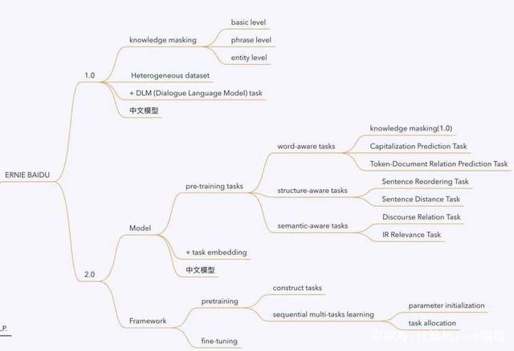
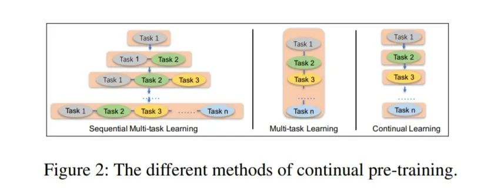

- 
- Ernie1.0百度
- Basic-Level Masking：这就是BERT中采用的token粒度的随机masked，只能学习到基本的语义信息，对于深层语义信息比较难建模。
  Phrase-Level Masking：短语是几个字词组成的概念单元。英文中可通过词法分析（lexical analysis and chunking tools）获取短语边界，中文中可以使用分词工具获取word/phrase信息。然后，随机masked掉一些phrase。
- Entity-Level Masking：通过命名实体识别（Named Entity Recognition）将实体识别出来，并随机masked掉一些entity。
- 而是在pretrainning阶段增加了外部的知识，由三种level的mask组成
- 需要注意的是这些知识的学习是在训练中隐性地学习，而不是直接将外部知识的embedding加入到模型结构中（**ERNIE-TsingHua**[4]的做法）
- **Heterogeneous Corpus Pre-training**
- 中文百度百科，维基百科
- Basic level masking 在预训练中，第一阶段是先采用基本层级的masking，即随机mask掉中文中的一个字。
  Phrase level masking第二阶段是采用词组级别的masking。我们mask掉句子中一部分词组，然后让模型预测这些词组，在这个阶段，词组的信息就被encoding到word embedding中了。
  Entity level masking在第三阶段命名实体，如：人名，机构名，商品名等，在这个阶段被mask掉，模型在训练完成后，也就学习到了这些实体的信息。
- **DLM (Dialogue Language Model) task**
- 百度的ernie还基于百度贴吧的数据进行了对话训练，对话的数据对语义表示很重要，因为对于相同回答的提问一般都是具有类似语义的，不同于BERT的输入形式，ERNIE能够使用多轮对话的形式，采用的是三个句子的组合[CLS]S1[SEP]S2[SEP]S3[SEP] 的格式
- DLM还增加了任务来判断这个多轮对话是真的还是假的
- #**ERNIE 2.0**: A Continual Pre-Training Framework for Language Understanding[5]，百度ERNIE2.0 的出现直接刷新了GLUE Benchmark。
- 「Inituition」就像是我们学习一个新语言的时候，我们需要很多之前的知识，在这些知识的基础上，我们可以更快地学习新语言，如此就有了迁移学习的效果。我们的语言模型如果增加多个任务的话，是不是可以获得更好的效果？于是科学家们就在想那一直加task岂不是更强？百度不满足于堆叠任务，而是提出了一个持续学习的框架，利用这个框架，模型可以持续添加任务但又不降低之前任务的精度，从而能够更好更有效地获得词法lexical，句法syntactic，语义semantic上的表达。
- 在ERNIE1.0的基础上，利用了大量的数据，以及先验知识，然后提出了多个任务，用来做预训练，最后根据特定任务finetune。框架的提出是针对**life-long learning**的，即终生学习，因为我们的任务叠加，不是一次性进行的（Multi-task learning），而是**持续学习**(Continual Pre-training)，所以必须避免模型在学了新的任务之后，忘记旧的任务，即在旧的任务上loss变高，相反的，模型的表现应该是因为学习了之前的知识，所以能够更好更快的学习到现有的任务。为了实现这个目的，百度提出了一个包含pretraining 和fine-tuning的持续学习框架。
- 百度的解决方案是，框架自动在训练的过程中为**每个任务安排训练N轮**。
  初始化 optimized initialization每次有新任务过来，持续学习的框架使用之前学习到的模型参数作为初始化，然后将新的任务和旧的任务一起训练。
  训练任务安排 task allocating对于多个任务，框架将自动的为**每个任务在模型训练的不同阶段安排N个训练轮次**，这样保证了有效率地学习到多任务。如何高效的训练，每个task 都分配有N个训练iteration。One left problem is how to make it trained more efciently. We solve this problem by allocating each task N training iterations. Our framework needs to automatically assign these N iterations for each task to different stages of training. In this way, we can guarantee the efciency of our method without forgetting the previously trained knowledge
  部分任务的语义信息建模适合递进式：比如ERNIE 1.0 突破完形填空ERNIE 2.0 突破选择题，句子排序题等不断递进更新，就好像前面的任务都是打基础，有点boosting的意味
  顺序学习容易导致遗忘模式（这个可以复习一下李宏毅的视频），所以只适合学习任务之间比较紧密的任务，就好像你今天学了JAVA，明天学了Spring框架，但是如果后天让你学习有机化学，就前后不能够联系起来，之前的知识就忘得快
- ERNIE模型堆叠了大量的预训练目标。就好像我们学习英语的时候，我们的卷子上面，有多种不同的题型。
- 词法层级的任务(word-aware pretraining task)：获取词法知识
  knowledge masking(1.0)
- 大小写预测（Capitalization Prediction Task）
  模型预测一个字不是不是大小写，这个对特定的任务例如NER比较有用。（但是对于中文的话，这个任务比较没有用处，可能可以改为预测某个词是不是缩写）
- 词频关系（Token-Document Relation Prediction Task）
  预测一个词是不是会多次出现在文章中，或者说这个词是不是关键词。
- 语法层级的任务(structure-aware pretraining task) ：
- 获取句法的知识句子排序(Sentence Reordering Task) 把一篇文章随机分为i = 1到m份，对于每种分法都有i!种组合，所以总共有
- 模型的结构和BERT一致，但是在预训练的阶段，除了正常的position embedding，segment embdding，token embedding还增加了「task embedding」。用来区别训练的任务, 对于N个任务，task的id就是从0～N-1，每个id都会被映射到不同的embedding上。模型的输入就是：
- 