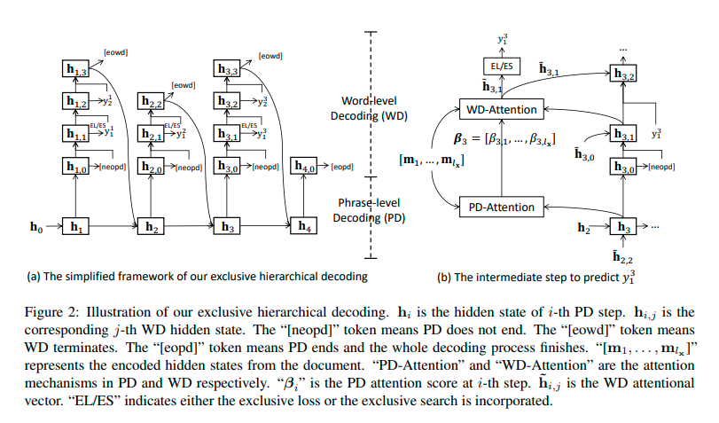

- 
- We first encode each word of the document into a hidden state and then employ our exclusive hierarchical decoding
- Our hierarchical decoding process consists of phrase-level decoding (PD) and word-level decoding (WD)
- 这篇文章的exclusive的意思就是以前的key phrase generation容易生成重复的短语，他们在这里采用了一种机制来避免这种情况
- Then, the hidden representation of the captured aspect is employed to initialize the WD process to generate a new keyphrase word by word
-
  >Sequential Encoder
- To obtain the context-aware representation of each document word, we employ a two-layered bidirectional GRU (Cho et al., 2014) as the document encoder
-
  >Hierarchical Decoder
- Our hierarchical decoding process is controlled by the hierarchical decoder, which utilizes a phrase level decoder and a word-level decoder to handle the PD process and the WD process respectively
	- Phrase-level Decoder
		- We adopt a unidirectional GRU layer as our phraselevel decoder
	- Word-level Decoder
		- We choose another unidirectional GRU layer to conduct word-level decoding. Under the i-th PD step, the word-level decoder updates its hidden state first
-