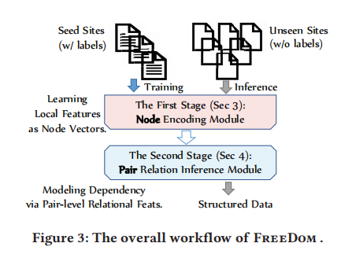
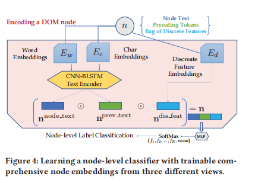
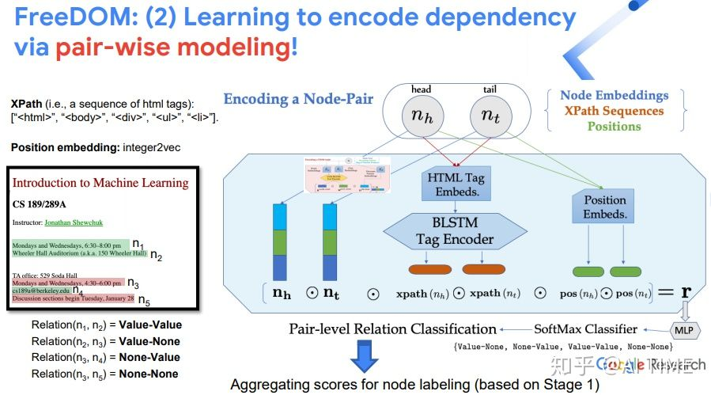
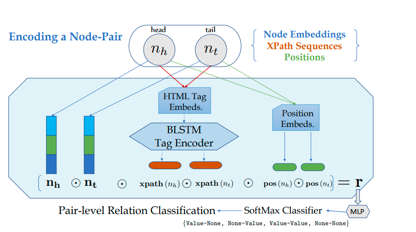

- 
-
  >第一阶段：基于DOM Tree学习每一个node的local feature；但只用了node的局部信息，不包括与邻居node间的结构信息
	- 主要由三部分组成
		- node本身的文本(Element of …)；
		- node之前的文本，称为preceding tokens(Textbook)；
		- 基于node的一些离散信息(比如，node的类型；是否包含url；是否包含数字等)。
	- 最后concatenate三者的feature vectors作为整个node的表征，再由**MLP（多层感知机）**进行分类softmax，分类结果L is either a pre-defined field (out of K types) or a “none” label
	  background-color:: #533e7d
	- The concatenated output representation is connected to a multilayer perceptons (MLPs) for multi-class classification via a SoftMax classifier (see Figure 4) that is illustrated in the following equations:
- 
-
  >第一个模型存在的问题：
	- 仅仅使用local的node表征带来了一些问题，
	- 一是：具有迷惑性的local features。比如下图所示，两次出现Time，紧邻Instructor 的Time更可能表示为课程的上课时间；紧邻TA Office的Time更可能表示为教室开放的时间。
	- 二是：缺失类似于Textbook这样的词。在训练中会发现类似的网页结构，即Time 和Location往往会挨在一起，Textbook总是出现在Overview或者Description的下面。因此，可通过加强这种猜测，学习一些node之间的dependency，以更好的做决策
-
- 
- 
-
-
  >第二阶段解决方案 Node-pair relation networks
- 首先构建node pair,根据第一阶段的分类结果，将node分为两类，一类是certain field。将其对应的节点作为锚定节点，一类是uncertain field,对于uncetain field选取分数最高的前m节点来构建node pairs
- 这个第二阶段的关键思想是：我们希望某些字段可以作为模型的支点，通过其基于距离的特征来提取混乱的字段
- 比如我们有k个fields和T个cetain fields，T\*(T-1)+2\*T\*(K-T)\*m+(K-T)\*(K-T-1)\*m^2 node pair to score
- 作者团队提出了通过pair-wise modeling建模节点间的dependency。该思路是指通过编码每一对node-pair，并学习其关系类型Value-Value，Value-None，None-Value，None-None，来判断给定node pair是否为Value-Value。
- 具体地，node pair的representation也是由三部分组成：
	- 模型第一阶段学习到的node表征；
	- node的HTML Tag的embedding，即XPath的sequence；
	- 以及node的position，可从标签body开始往下数
- 同样地，concatenate三者的feature vectors作为给定relational node-pair features。由Classification model 判断node-pair的关系类型，同时可结合第一阶段得分，删除第一阶段中False Positive的节点。
-
  >Filtering Fixed DOM Nodes.
	- Specifically, we first collect all possible XPaths (i.e. node identifiers) of textual nodes in the website and then keep the number of different texts inside each node
	- Then, we rank all nodes by these numbers, and take top-k of the XPaths with more than two different values as the variable nodes
	- The basic assumption behind this filtering is that we believe value nodes are more likely to have more different texts inside different pages and at least show two different values