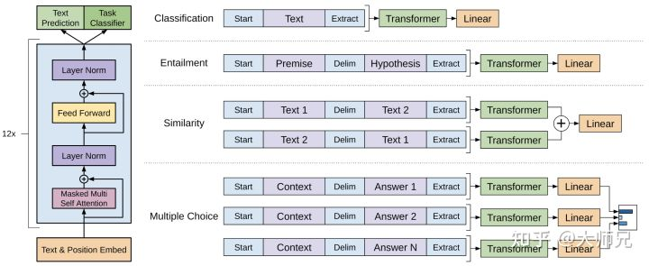
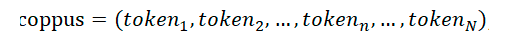
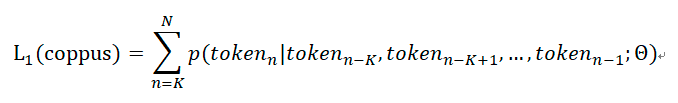
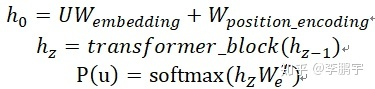
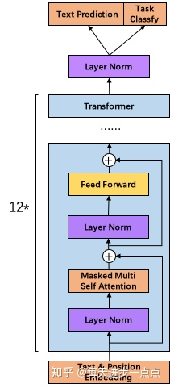
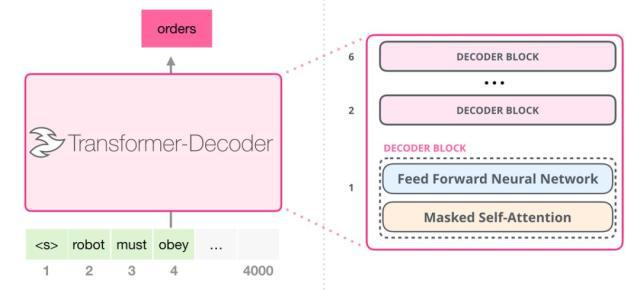
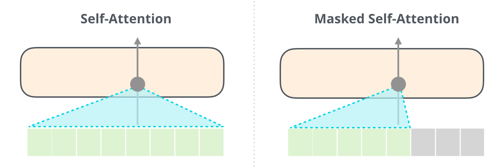
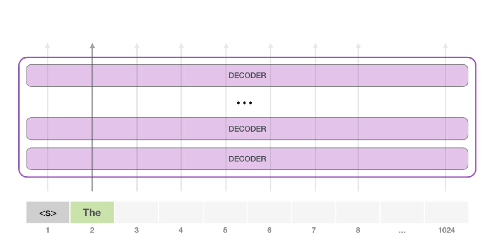
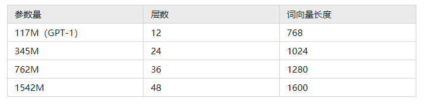

- GPT是openAI发布的系列模型
- [[Improving Language Understanding by Generative Pre-Training]]
-
  >GPT1
- {:height 296, :width 704}
- 图2：(左)：transformer的基本结构，（右）：GPT-1应用到不同任务上输入数据的变换方式
- **预训练模型（无监督）**
	- 基于过去K个token来预测当前token
	- 
	- 
	- 
-
-
  >GPT2
- GPT-2依然沿用GPT单向transformer的模式，只不过做了一些改进与改变
	- GPT-2去掉了fine-tuning训练
	- 增加数据集：既然要博览群书，当然得先有书，所以GPT-2收集了更加广泛、数量更多的语料组成数据集
	- 增加网络参数：GPT-2将Transformer堆叠的层数增加到48层，隐层的维度为1600，参数量更是达到了15亿。15亿什么概念呢，Bert的参数量也才只有3亿哦
	- 调整transformer：将layer normalization放到每个sub-block之前，并在最后一个Self-attention后再增加一个layer normalization。
- 模型参数
	- 同样使用了使用字节对编码构建字典，字典的大小为50257  ；
	  滑动窗口的大小为1024  ；
	  batchsize的大小为 512；
	  将残差层的初始化值用  进行缩放，其中  是残差层的个数。
- 
-
-
- 
- 
- 
- 请注意，第二个单词的路径是当前唯一活跃的路径了。GPT-2 的每一层都保留了它们对第一个单词的解释，并且将运用这些信息处理第二个单词（具体将在下面一节对自注意力机制的讲解中详述），GPT-2 不会根据第二个单词重新解释第一个单词。
- The simplest way to run a trained GPT-2 is to allow it to ramble on its own (which is technically called generating unconditional samples)
- 综上，GPT-2的核心思想概括为：任何有监督任务都是语言模型的一个子集，当模型的容量非常大且数据量足够丰富时，仅仅靠训练语言模型的学习便可以完成其他有监督学习的任务。
- GPT-2的学习目标是使用无监督的预训练模型做有监督的任务, GPT-2的最大贡献是验证了通过海量数据和大量参数训练出来的词向量模型有迁移到其它类别任务中而不需要额外的训练。
- GPT-2训练了4组不同的层数和词向量的长度的模型
- 
-
  >GPT-3：海量参数
- 模型
- GPT-3沿用了GPT-2的结构，但是在网络容量上做了很大的提升，具体如下：
	- GPT-3采用了 96层的多头transformer，头的个数为 96；
	  词向量的长度是12888 ；
	  上下文划窗的窗口大小提升至  2048个token；
	  使用了alternating dense和locally banded sparse attention[11]。
- 在大量的语言模型数据集中，GPT-3超过了绝大多数的zero-shot或者few-shot的state-of-the-art方法。另外GPT-3在很多复杂的NLP任务中也超过了fine-tune之后的state-of-the-art方法，例如闭卷问答，模式解析，机器翻译等。除了这些传统的NLP任务，