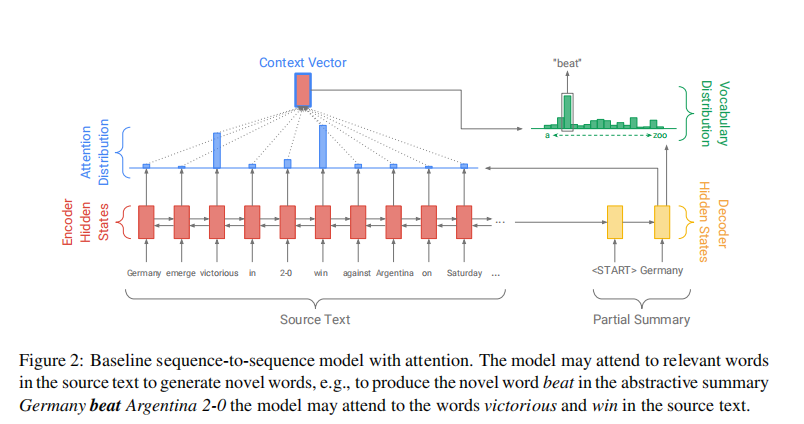

title:: Get To The Point: Summarization with Pointer-Generator Networks

- https://paperswithcode.com/paper/get-to-the-point-summarization-with-pointer
- 
- First, we use a hybrid pointer-generator network that can copy words from the source text
  via pointing, which aids accurate reproduction of information, while retaining the ability to produce novel words through the generator. Second, we use coverage to keep track of what has been summarized, which discourages repetition.
- copy机制，在每一次解码的时候，计算一个概率，根据这个概率选择是否从原文中复制词语，有效解决未登录词的问题；
  coverage机制，让注意力机制避免多次在同一个地方赋予高权重，避免重复