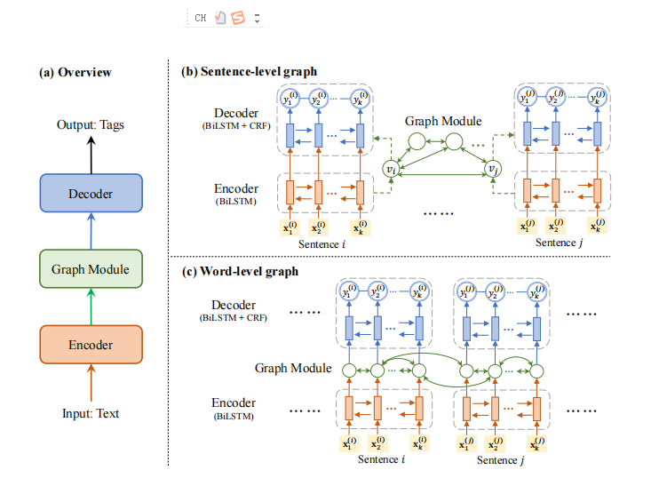
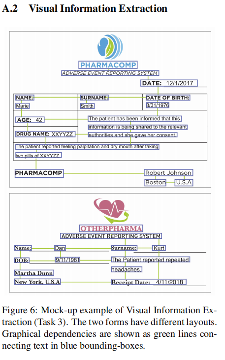

title:: GraphIE: A Graph-Based Framework for Information Extraction

- https://github.com/polynoman/The-Annotated-GraphIE
- https://github.com/thomas0809/GraphIE
- GCN
- 
- We formalize information extraction as a sequence tagging problem. Rather than simply modeling inputs as sequences, we assume there exists a graph structure in the data that can be exploited to capture non-local and non-sequential dependencies between textual units, namely words or sentences.
-
  >We consider two different designs of the graph:
	- sentence-level graph
	- word-level graph
-
  >Our model has three components:
	- **an encoder**.which generates local context-aware hidden representations for the textual unit (i.e. word or sentence, depending on the task) with a recurrent neural network;
	- **a graph module**, graph module is a **GCN**; which takes as input the sentence representation and conducts graph convolution on every node, propagating information between its neighbors, and integrating such information into a new hidden representation.
	- **a decoder**, In our work, the decoder is instantiated as a BiLSTM+CRF tagger
-
- 
- We use the BIO (Begin, Inside, Outside) tagging scheme in this paper.
-
-
-