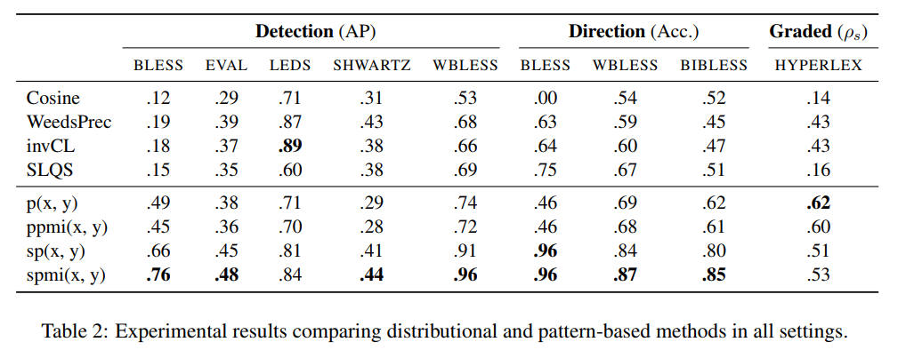

title:: Hearst Patterns Revisited: Automatic Hypernym Detection from Large Text Corpora

- 
- useded dataset
- (Hypernymy Detection): BLESS, LEDS, EVAL, SHWARTZ, WBLESS
  (Hypernymy Direction): BLESS, WBLESS, BIBLESS
  (Graded Entailment): HyperLex
-
- The largest dataset is SHWARTZ (Shwartz et al., 2016), which was collected from a mixture
  of WordNet, DBPedia, and other resources.
- Hypernymy Detection
	- In hypernymy detection, the task is to classify whether pairs of words are in a hypernymy relation
- Hypernymy Direction:
	- In direction prediction, the task is to identify which term is broader in a given pair of words.
- Graded Entailment:
	- In graded entailment, the task is to quantify the degree to which a hypernymy relation holds.
- 文章中使用的hearst patterns
- {:height 460, :width 488}