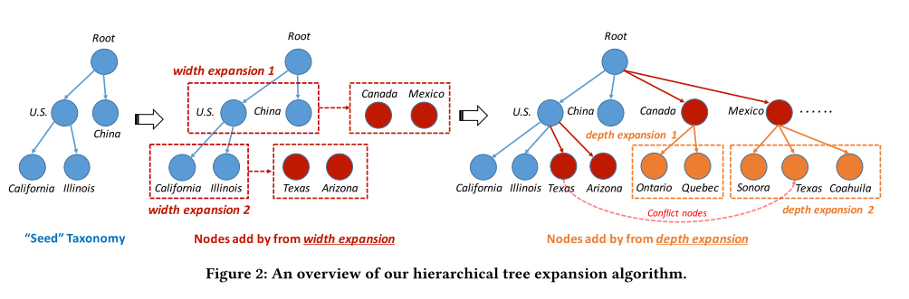
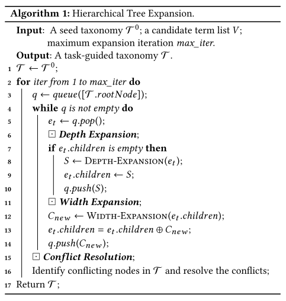
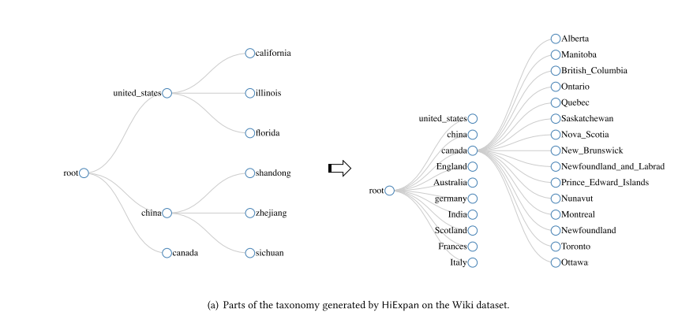

title:: HiExpan: Task-Guided Taxonomy Construction by Hierarchical Tree Expansion

- 他这篇文章总体来说真的是做到了把现实问题转化为科学问题的典范，解决的虽然是现实中比较简单的那种任务情景，但总体来说这份工作还是有意义的
- {:height 240, :width 704}
- 他这个模型的迭代步骤中总体上就分为2步，第一步是width expansion，第二步是depth expansion, 就是对于树，先横向扩充同一个父节点下的子节点，然后再针对每个叶子节点去扩充该叶子节点的子节点
- 最后的话他还会对这个树的整体结构做一个优化，因为他在构建的过程中发现有的叶子节点的位置会跑错就跑到别的父节点下面，所以他在这里又做了一个优化模型来对各个节点的更准确的位置做个优化
- 总体的工作的全是基于他们组的自己的工作
- 
-
-
- 