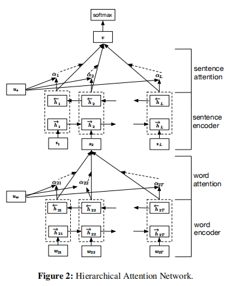
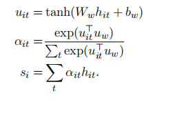

- 
- 这篇文章是把一段文字分成几个句子，然后每个句子又又几个单词组成
- 单词使用word2vector做初始编码，用双层GRU做encoding
- 他的思想就是首先在下面一层，计算每个句子中每个单词的注意力得分，计算注意力的query向量是固定的，是自动学习得来的，这个query向量就相当于一个固定的问句
- what is the informative word?
- 然后在上面一层计算每个句子的注意力得分,这层计算注意力的方式也差不多，需要学习到一个固定的query向量来判断哪个句子对分类作用是帮助比较大的
- 两层计算注意力的函数都为
- 
- 都是加性模型,就是说先把字符表示转换为另一个表示，然后将其与一个固定的 向量做相似性运算，作为该字符或句子的权重
- 这篇文章中除了用attention来聚合之外，还有用到average pooling和max pooling
- 最后发现这三种方式效果是差不多的
-
-
-
-
- 这篇论文最后还对注意力进行了可视化，探究他是否将注意力放到了真正的对分类有意义的词
- 反正我是感觉这个注意力学习的不太好
- 他是以单词good 和bad的权重来作为举例
- 发现在YELP 1-5评级的数据集中
- good的权重在1中被分配较大权重的概率较大，在5中被分配较小的权重的概率较大
- bad的权重在5中被分配较大权重的概率较大
-
-
-
-
- 这篇论文的最终准确率不是太高，结构很花里胡哨
- #层次注意力
- [[论文信息抽取]]