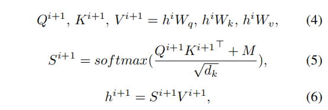
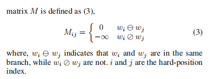
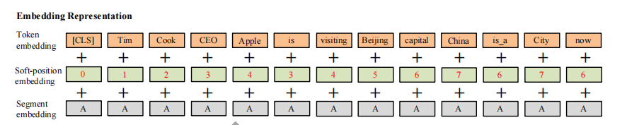
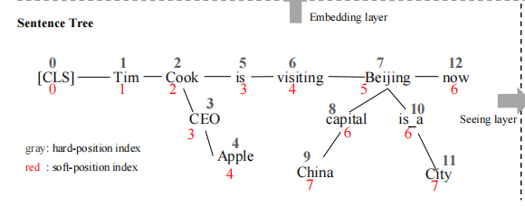

- 预训练模型之前就已经有人讲kg和word vecor相结合了
- 这篇文章提出了mask-transformer结构，具体就是先将树结构的句子转换成序列形式的，然后计算注意力的时候，用mask机制，具体就是不可见的两个节点之间全部给他mask到0，注意力赋0值
- 
- M就是mask矩阵
- 
- 下面这个是他的embedding输入，每个句子会有三个输入，还有一个mask矩阵作为输入
- 
-
- 
- 对句子进行位置编码的时候，使用软性编码，也就是以分叉形式注入的知识不会影响原始句子的顺序，图中红色的数字就是位置编码
- 这个mask的思想是三元组只对三元组内的元素可见，对其他元素不可见
- 最后作者也展望了
- 提高汲取相关知识的能力，加入筛选器，不要一股脑把相关的三元组都塞进去，基于上下文过滤掉不重要的三元组
-
-