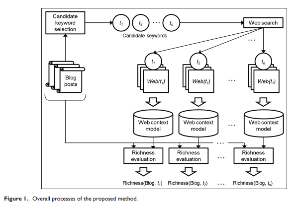

- In this paper, a new measure, Richness, is proposed. The richness of a blog for a given keyword is a score that indicates how much trendy content the blog includes, from the viewpoint of the given keyword. In order to obtain the trendy subtopics of a keyword, the web context related to the keyword is extracted. The content of blogs is evaluated, based on the web context
- 这篇文章定义了一个新的概念，词汇在文章中的语义丰富度
- 他认为通常来说一个word会出现在很多个子主题中，如果一篇文章涵盖的这个词汇所代表的子主题的数量越多，那么这个word就越应该被选择这篇文章的keyword
- 他解析每篇文章的的整体的方式是通过LDA的方式，
- 一共包含三步
- 
- 首先是获取每个blog中的待选keyphrase，这个选择的方式也是用LDA,如果一个词对这篇文章的贡献度越大，就越应该被选择待选关键短语