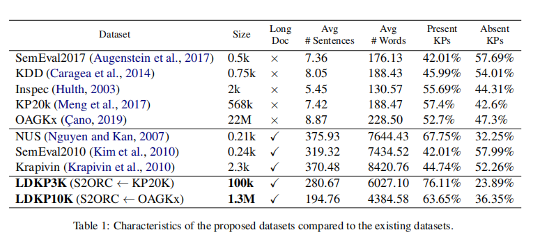
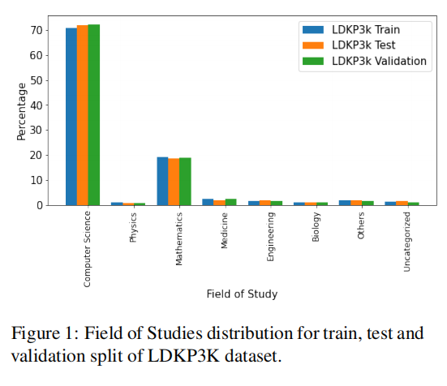
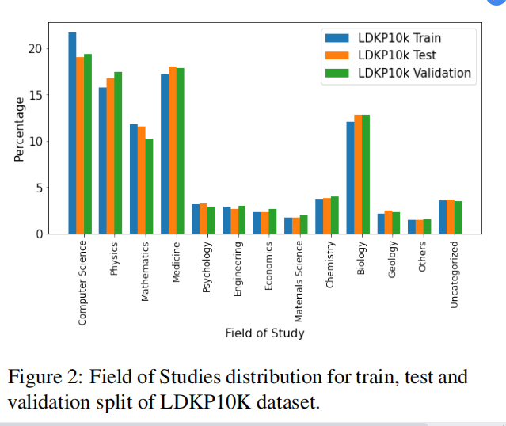

title:: LDKP: A Dataset for Identifying Keyphrases from Long Scientific Documents

- https://github.com/midas-research/ldkp
- 
- we took the KP20K and OAGKx scientific corpus for which keyphrases were already
  available and mapped them to their corresponding documents in S2ORC.
- LDkp (Long Document keyphrase) dataset is the first benchmark corpus of 1.3M documents for identifying keyphrases from long documents. The LDkp dataset is released in two versions :
- **LDkp3k**: consists of 100k keyphrase tagged long documents, is created using keyphrases from KP20k (Meng et al., 2017) and their corresponding long document text from S2ORC (Lo et al., 2020).
- 
- **LDkp10k**: The second dataset LDkp10k consisting of 1.3M long documents along with target keyphrases is created using keyphrases from OAGKX (Çano, 2019) and their corresponding long document text from S2ORC (Lo et al., 2020).
- 
- from various domains
- We did this for common sections including introduction, related work, conclusion, methodology, results, and analysis.
-
-