title:: LayoutLMv2: Multi-modal Pre-training for Visually-rich Document Understanding

- https://aka.ms /layoutlmv2
- 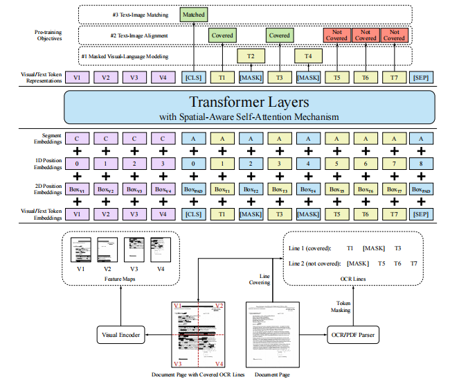
- we explore how to further improve the pre-training strategies for the VrDU tasks.
-
  >Model Architecture
	- Text Embedding: we use WordPiece to tokenize the OCR text sequence and **assign each token to a certain segment**$s_i \in\{[\mathrm{A}],[\mathrm{B}]\}$
		- 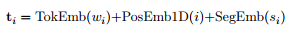
	- Visual Embedding: we leverage the output feature map of a CNN-based visual encoder, which converts the page image to a fixed-length sequence. We use ResNeXt-FPN  architecture as the backbone of the visual encoder,这个是包含空白区域的
		- 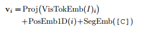
		-
	- Layout Embedding
		- we normalize and discretize all coordinates to integers in the range [0; 1000], and use two embedding layers to embed x-axis features and y-axis features separately.
		- the layout embedding layer concatenates six bounding box features to construct a token-level 2D positional embedding, aka the layout embedding
		- 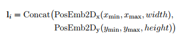
		- When calculating bounding boxes, the visual tokens can be treated as evenly divided grids，An empty bounding box boxPAD = (0; 0; 0; 0; 0; 0) is attached to special tokens [CLS], [SEP] and [PAD].
		- 这篇文章是采用了二维相对位置编码的
-
  >Multi-modal Encoder with Spatial-Aware SelfAttention Mechanism
- The encoder concatenates visual embeddings $\left\{\mathbf{v}_0, \ldots, \mathbf{v}_{W H-1}\right\}$ and text embeddings $\left\{\mathbf{t}_0, \ldots, \mathbf{t}_{L-1}\right\}$ to a unified sequence and fuses spatial information by adding the layout embeddings to get the $i$-th $(0 \leq i<W H+L)$ first layer input
- 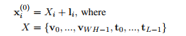
- we introduce the spatial-aware self-attention mechanism into the self-attention layers
- Considering the large range of positions, we model the semantic relative position and spatial relative position as bias terms to prevent adding too many parameters.
- The biases are different among attention heads but shared in all encoder layers. Assuming (xi; yi) anchors the top left corner coordinates of the i-th bounding box. we obtain the spatial-aware attention score
- 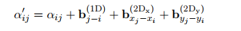
-
  > Pre-training Tasks
	- Text-Image Alignment文本图像对齐
		- 遮住text token对应的图像，用text token最终表示预测他是否被遮住了
	- Text-Image Matching文本图像匹配
		- 将text token与visual token进行document之间的互换表示，预测他们之间是否是匹配的
	- masked visual-language modeling文本预测
		- 遮住一部分text token去预测被遮住的token是啥，这个预测的时候还会把对应的visual  token 部分给遮住
- 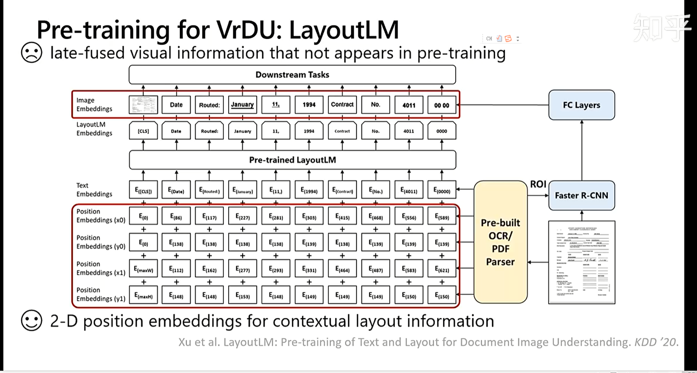{:height 385, :width 704}
- LayoutLMv2融合了三种输入信息一种是文本信息，一种是图像信息（直接整张图输进去，并没有将文本与图像对齐与第一代的layoutLM不同），一种是二维坐标信息
- 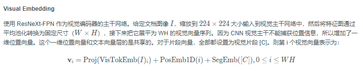
- 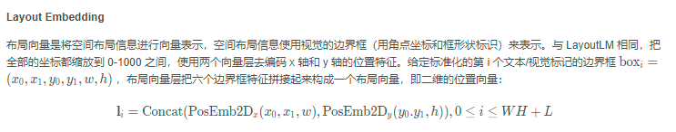
- 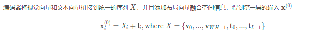
-
  >data
- 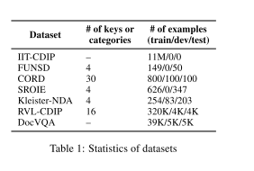
- Following the typical pre-training and fine-tuning strategy, we update all parameters including the visual encoder layers, and train whole models end to-end for all the settings.
- LayoutLMv2BASE is trained with a batch size of 64 for 5 epochs, and LayoutLMv2LARGE is trained with a batch size of 2048 for 20 epochs on the IIT-CDIP dataset
- The numbers of parameters are 200M and 426M approximately for LayoutLMv2BASE and LayoutLMv2LARGE, respectively
- During pre-training, we sample pages from the IIT-CDIP dataset and select a **random sliding window of the text sequence if the sample is too long**. We set the **maximum sequence length L = 512** and assign all text tokens to the segment [A]. The output shape of the average pooling layer is set to W = H = 7, so that it transforms the feature map into 49 visual tokens