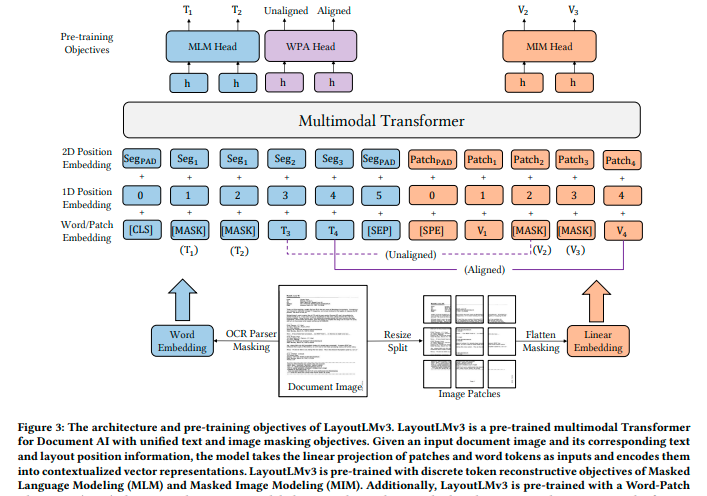
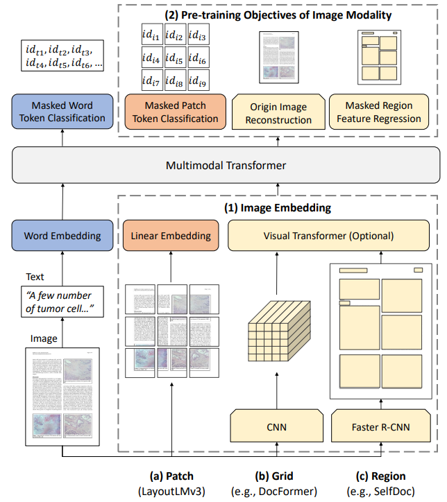

title:: LayoutLMv3: Pre-training for Document AI with Unified Text and Image Masking

- 这篇文章他说到最后这个模型在下游的任务中不仅在以图像为中心的任务中表现的很好，在以文字为为中心的任务中也表现的很好
- {:height 502, :width 704}
- 
-
- The Transformer has a multilayer architecture and each layer mainly consists of multi-head
  self-attention and position-wise fully connected feed-forward networks
- The input of Transformer is a concatenation of text embedding Y = y1:𝐿 and image embedding X = x1:𝑀 sequences, where 𝐿 and 𝑀 are sequence lengths for text and image respectively.
- We pre-processed document images with an off-the-shelf OCR toolkit to obtain textual content and corresponding 2D position information.
- 文章贡献：
- 1）第一个不用CNN的文档AI（归功于ViLT）
- 2）使用MIM和MLM，WPA（归功于Beit）
- 3）模型的通用性很好，在文本和图像任务都很好。（Transformer适用于多模态）
- 4）多个任务上的SOTA
- ViLT+Beit+Bert+layout。
-
  >Embedding
- **Text Embedding**
	- The position embeddings include 1D position and 2D layout position embeddings,
- **Layout Embedding**
	- The LayoutLM and LayoutLMv2 adopt word-level layout positions, where each word has its positions. Instead, we adopt segment-level layout positions that words in a segment share the same 2D position since the words usually express the same semantic meaning
- **Image Embedding**
	- 不同于先前的文档理解多模态模型，大都需要一个CNN或者Faster-RCNN抽取图片上的视觉信息。
	- 从VIT收到启发，直接采用VIT的预处理策略：图片resize(H\*W)->分patch->线性映射，组成$shape=[ h w / patch\_size^2, d ]$的tensor，再加上其1d position embedding，(2d layout information被扔了，因为作者发现他没给模型效果带来多大提升)就构成了视觉特征。这样做降低了模型参数量、移除了相对较复杂的预处理流程。
	- LayoutLMv3 is the first multimodal model in Document AI that does not rely on CNNs to extract image features, which is vital to Document AI models to reduce parameters
	  or remove complex pre-processing steps
- **Self-attention**
  沿用layoutLMv2的spatial aware self attention。
	- We insert semantic 1D relative position and spatial 2D relative position as bias terms in self-attention networks for text and image modalities following LayoutLMv2
-
  >Pre-training Objectives
- **Masked Language Modeling(MLM)**: 每次mask掉30%的token。
- 不再是随机、孤立的mask掉某个token，而是一次性mask一定长度的tokens。长度从泊松分布（λ=3）中抽样确定。
-
- **Masked Image Modeling(MIM)**: 随机mask掉约40%的image toke，mask策略采用blockwise masking strategy。（具体参照[[Beit]]）。
	- 被mask掉的patch通过image tokenizer转化为离散的数字（image tokenizer来源于预训练DiT），进而对这些masked patch进行预测即可。
	-
- **Word-Patch Alignment(WPA)**: 前俩预训练任务没有显式的做visual和text之间的模态对齐。
- 对于前两个任务所产生的输入，这里会对每个text token赋予<aligned>以及<unaligned>标签。
- 对于那些text token没被MLM掉，但是被MIM掉（每个text token会有其位置信息的）的，赋予<unaligned>标签。对于那些没被MLM掉，也没被MIN掉的，赋予<aligned>标签。
- 对于以上被标记了的token，通过两层FC进行预测是aligned还是unaligned，所以是一个二分类。
  这里要忽略掉那些被MLM掉的text token，即它们不参与loss计算，这么做事为了防止模型从masked text以及image patch之间学到一些没什么用的关系。
- 在多模态任务中，必然会有一个任务是可以将文本与图像产生联系的。回顾 v2 版本的模型，主要采用的方法是将通过将不同行的图像文本进行覆盖（实际覆盖的范围是一个 bbox） ，然后通过预测未覆盖文本对应的图像片段是否被覆盖来产生文本与图像的关联性。但在 v3 中所有的图像都是通过 patch 的方式直接映射为图像特征，mask 的最小单位不再是 bbox，而是 patch 本身。那么把 v2 的任务进行简单的转换，v3 版本的 WPA 就是预测被覆盖文本对应的 patch 是否被覆盖。
-
  >setting
- Transformer encoder with 12-head self-attention, hidden size of 𝐷 = 768, and 3,072 intermediate size of feed-forward networks.
- Our image tokenizer is initialized from a pre-trained image tokenizer in DiT, a self-supervised pre-trained document image Transformer model
- we tokenize the text sequence with Byte-Pair Encoding (BPE) [46] with a maximum sequence length 𝐿 = 512.
- The parameters for image embedding are 𝐶 × 𝐻 ×𝑊 = 3 × 224 × 224, 𝑃 = 16, 𝑀 = 196.
- 用到的节省显存和加速的技巧
	- distributed and mixed-precision training
	- gradient accumulation mechanism to split the batch of samples into several mini-batches to overcome memory constraints for large batch sizes.
	- We further use a gradient checkpointing technique for document layout analysis to reduce memory costs
-
-
-
-
-
-
-
-
-
-
-
-
-