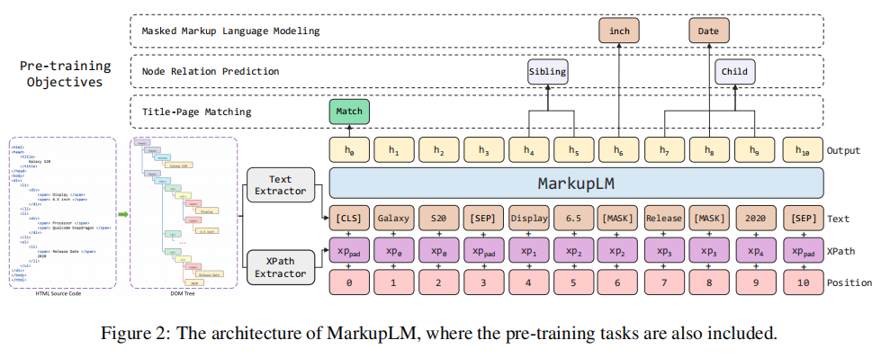
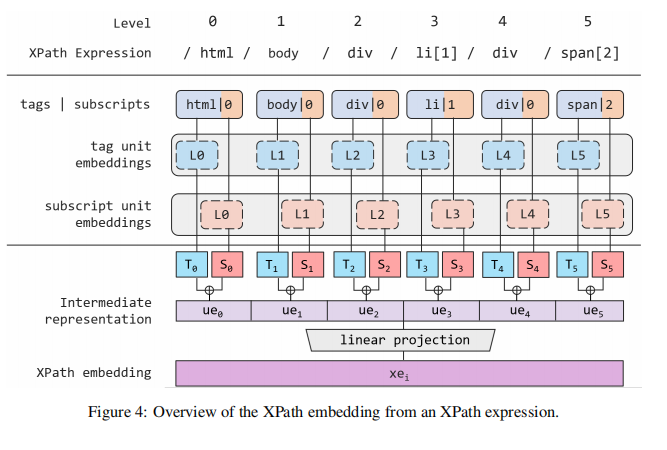

title:: MarkupLM: Pre-training of Text and Markup Language for Visually-rich Document Understanding

- 这篇文章有代码
- https://github.com/microsoft/unilm/tree/master/markuplm
- 
-
- MarkupLM has four input embedding layers
	- a text embedding that represents the token sequence information
	- an XPath embedding that represents the markup tag sequence information from the root
	  node to the current node
		- 
		- 先把tag embedding和下标数字的embedding相加，然后再把所有的字符拼接起来，再做一个线性转换就成了，不同深度的tag embedding和下标数字embedding是不一样的
		- To facilitate further process, we do truncation and padding on $x p_{\text {list }}^i$ to unify their lengths as $L$.他这个地方是做了pad和trunction
		- Finally, to match the dimension of other embeddings, we apply a linear transformation on ri to get the final XPath embedding xei.
		- $x e_i=W r_i+b, W \in \mathbb{R}^{d_h \times\left(L d_u\right)}, b \in \mathbb{R}^{d_h}$
		- For $\left(t_j^i, s_j^i\right)$, we input this pair into the $j$-th tag unit embedding layer and $j$-th subscript unit embedding layer respectively, and they are added up to get the $j$-th unit embedding $u e_j^i$. We set the dimensions of these two embeddings as $d_u$.
	- a 1D position embedding that represents the sequence order information
	- a segment embedding for downstream tasks
- we use the BERT architecture as the encoder backbone and add a new input embedding named XPath embedding to the original embedding layer.
-
-
  >Pre-training Objectives
	- Masked Markup Language Modeling
		- Basically, with the text and markup input sequences, we randomly select and replace some tokens with [MASK], and this task requires the model to recover the masked tokens with all markup clues.
	- Node Relation Prediction
		- We firstly define a set of directed node relationships R ∈ {self, parent, child, sibling, ancestor, descendent, others}. Then we combine each node to obtain the node pairs. For each pair of nodes, we assign the corresponding label according to the node relationship set, and the model is required to predict the assigned relationship labels with the features from the first token of each node
	- Title-Page Matching
		- The third is the Title-Page Matching (TPM), where the content within “<title>
		  ... </title>” is randomly replaced by a title from another page to make the model learn whether they are correlated.
		- Given the element <body> of a markup-based document, we randomly replace the text of element <title> and ask the model to predict if the title is replaced by using the representation of token [CLS] for binary classification.
- pretrain with Common Crawl (CC), fine-tune with WEBSRC and SWDE
-
  >dataset
- Common Crawl
- WebSRC
- score (POS)
- SWDE
-
  >setting
- The size of the selected tags and subscripts in XPath embedding are 216 and 1,001
  respectively, the max depth of XPath expression is 50, and the dimension for the tag-unit embedding and subscript-unit embedding is 32.