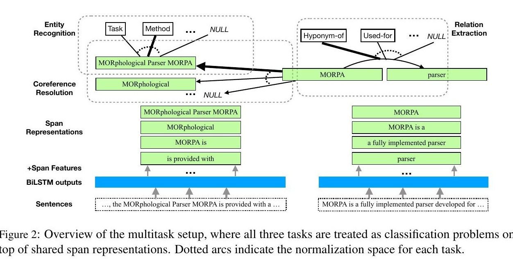

- 我们的数据集（称为SCIERC）包括对500个科学摘要的科学实体、它们的关系和共指集群的标注。这些摘要取自Semantic Scholar Corpus2中四个人工智能社区的12个人工智能会议/研讨会记录。SCIERC通过扩展实体类型、关系类型、关系覆盖率以及使用共指链接添加跨句子关系，扩展了之前科学文章中的数据集SemEval 2017 Task 10（SemEval 17）（Augenstein等人，2017）和SemEval 2018 Task 7（SemEval 18）（Ga´bor等人，2018）。我们的数据集可在以下网站公开获取：
- 他的标注方式是用BART界面
- http://nlp.cs.washington.edu/sciIE
- 表1显示了SCIERC的统计数据。
-  
  id:: 62d3f5cc-7f9d-4602-963f-8175b67c32bd
- **标注方案**
	- 我们定义了六种科学实体的标注类型（Task, Method, Metric, Material, Other-ScientificTerm and Generic）和七种关系类型（Compare, Part-of, Conjunction, Evaluate-for, Feature-of, Used-for, HyponymOf）。除了两个对称的关系类型（Conjunction和Compare）之外，方向性被考虑在内。共指链接在相同的科学实体之间进行标注。一个通用实体只有在涉及到一个关系或与另一个实体发生共指时才会被标注。标注指南可以在附录A中找到。图1显示了一个标注的例子。
- 
- The input is a document represented as a sequence of words $D =\{ w_1; ... w_n\}$, from which we derive $S = \{s1; ...; s_n\}$, the set of all possible
- The output contains three structures: the entity types E for all spans S, the relations R for all pair of spans S × S, and the coreference links C for all spans in S. The output structures are represented with a set of discrete random variables indexed by spans or pairs  of spans.
- 他这个模型做的工作就是把实体和实体间的关系和实体消岐共同在一个模型里面给做了，没什么特殊的，有的模型是先抽取实体，然后再分类关系，他是直接把loss写到一起了