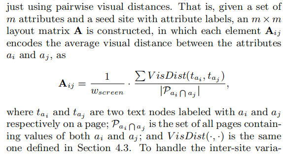

title:: One Tree to a Forest: a Unified Solution for Structured Web Data Extraction

-
- 
- 他这个整个论文抽取算法分为三个部分
	- - Feature extraction
	- - learning vertical knowledge
	- - adapting to a new websites
-
-
  > FEATURE EXTRACTION
	- Layout Features
		- DOM path + Visual size +  Visual position
		- 
		-
	- Content Features
		- Content features correspond to the **textual values contained in text nodes**, and are very useful for characterizing the semantics of text nodes. In this paper, the value contained in a text node t is denoted by vt, based on which five types of content features are extracted.
			- Unigram set
			- Token count:The values of many attributes consist of a relatively fixed number of tokens
			- Character count
			- Character type
			- Page redundancy
	- Context features
		- In contrast to layout features and most content features, context features exploit site-level information to capture **the surrounding text** indicating semantics of text nodes
			- preceding text
			- prefix and suffix: are defined as the beginning and ending substring (within its value vt) commonly shared by lots of text nodes across pages
	-
-
  >learning Vertical Knowledge
	- learning attribute specific semantics
		- we propose to exploit content and context features separately
			- content feature - **a classifier**, For each attribute aj , a classifier is trained to incorporate all the five types of content features
			- context feature-three lookup table
				- **three lookup tables** are respectively constructed for the preceding text, prefix, and suffix features
				- Each lookup table consists of feature values aggregated from text nodes in Tj
				- 
	- learning inter_attribute layout
		- 他是通过创建任意两个节点的距离矩阵的方式来学习属性位置距离之间的关系
		- 距离矩阵A计算方式为
		- 
- Knowledge of attribute-specific semantics is derived from content and context features
  for each attribute, while knowledge of inter-attribute layout is derived from layout features.
-
  >Adapting to a new website
	- the adaptation is based on a set of pages P sample randomly sampled from the new website.
	- Page-Level Semantic Prediction
	- Inter-Page Aggregation
	- Inter-Attribute Re-ranking
		- it is natural to exploit characteristics of attribute layout to re-rank those possible solutions
	- 他这个在不同网站之间迁移的思想就是利用属性对齐的思想
	- 让不同的字符串节点对齐
- rendering-feature baseline method
- boosting method就是一点一点改善结果的方法