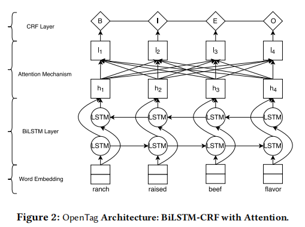

- https://github.com/lumiqai/UOI-1806.01264
- In this work, we leverage product profile information such as titles and descriptions to discover missing values of product attributes.
- We develop a novel deep tagging model OpenTag for this extraction problem with the following contributions:
	- (1) we formalize the problem as a sequence tagging task, and propose a joint model exploiting recurrent neural networks (specifically, bidirectional LSTM) to capture context and semantics, and **Conditional Random Fields** (CRF) to enforce tagging consistency;
	- (2) we develop a novel **attention mechanism** to provide interpretable explanation for our model's decisions;
	- (3) we propose a novel sampling strategy exploring active learning to reduce the burden of human annotation.
- OpenTag does not use any dictionary or hand-crafted features as in prior works.
- Word Embeddings
	- we learn the word representations conditioned on the attribute tag (e.g., ‘# avor’), and
	  generate di" erent representations for different attributes
- 
-
  > OPENTAG: ACTIVE LEARNING
- In this section, we present our novel active learning framework for OpenTag to reduce the burden of human annotation.
- The challenge is to design a good query strategy Q that selects the most informative samples from U given the learner’s hypothesis space. This aims to improve the learner’s performance with as little annotation e$ ort as possible.
- There are many different approaches to formulate a query strategy to select the
  most informative instances to improve the active learner.