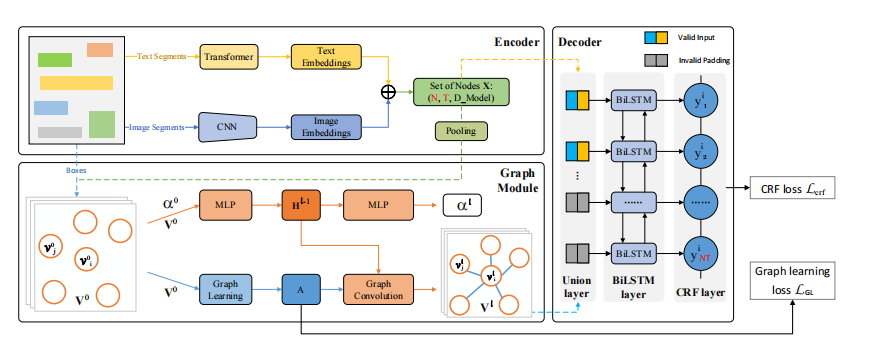
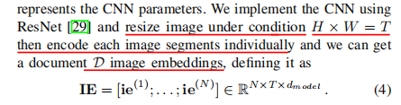
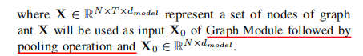
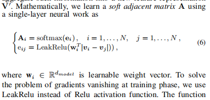

- {:height 296, :width 704}
- 这篇论文有代码 https://github.com/wenwenyu/PICK-pytorch
- Given a document with N text segments, its representation is denoted by S={s_1,...,S_n}
-
-
  >Encoder
- one branch of encoder generates text embedding using encoder of Transformer. Each text segment is encoded independently.
- another branch of encoder generate image embedding using CNN for catching morphology information. Given a image segment, image embeddings is defined as follows
- we implement the CNN using ResNet
-
- 
- 这个图片处理的 一个很邪门的地方就是他把这个图片的embedding的第一维等于这个图片包含的字符的个数，就是resize image的时候调的这个东西
- Finally we combine text embedding TE and image embedding IE through element wise addition operation for feature fusion and then generate the fusion embedding X of the document D
- X=TE+IE
  id:: 62a731ac-d2bd-4507-ae2c-a6acddcc2949
- 最后的输出是N\*T\*d维度的值，N代表文本片段个数，T代表片段所包含的字符的个数，d是向量维度
- 
- 然后对这个文本片段向量做了一个pooling运算
-
  >Graph Module
-
  1. graph learning
- Graph module generate a soft adjacent matrix A that represent the pairwise relationship  weight between two nodes，他这个边的建立的方式很奇怪的，没有像以前的文献中那样水平连接和垂直连接
- 
-
  2. Graph Convolution:
-
-
  >Decoder
- 这里首先是做了一个padding,然后是把encoder的输出和graph module的输出concate了起来，作为bilstm-crf的输入
- bilstm-crf
- We concatenated the node embedding of the output of Graph Module to packed sequence ˆX at each timestamps.
- 他这里是把图神经网络nodeembedding和encoder的输出拼接起来了
- 他这个bilstm-crf的输入应该是把整个文档一起输入的，就是把不同片段拼接在一起了
-
  >dataset
- Medical Invoice
- Train Ticket
- SROIE