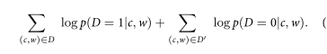
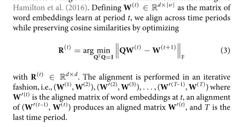
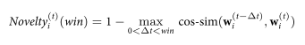

- 这篇文章的作者是德雷赛尔大学的陈超美
- citation analysis文献引用分析和文献共被引分析也是一个被研究了很久的问题，从文献引用网络的聚类分析中可以发现研究主题，研究子主题，研究热点的演变，分析evolution of topics, emerging topics
-
  >文献预处理步骤
- 去除URL,去除括号，单词大小写转换，破折号去除，替换缩略词
-
  >Temporal Embeddings
- 这篇文章是用到了word2vector训练词向量，并且训练的时候把语料以5年为一个时间段作为划分
- 就是用到了一个temporal embedding learning technique
- we present a new approach to measuring the novelty of a research topic in a scientific community over a specific period by tracking semantic changes of the terms and characterizing the research topic in their usage context
- 就是通过这种以时间为单位的训练方式来反映词义随着时间的变化
- 下面这个是他的训练公式
- 
-
  >Alignment of embeddings
- 他这个在以不同的时间单位划分语聊之后，因为划分到了不同的特征空间，所以如果需要比较一个主题词的语义变化的话，还需要做个空间转换，他这个空间转换的方式就是做成了一个优化问题，把k个时间段训练出来的k个空间合并到一个空间
- 
-
  >novelty
- We compute the cosine similarity (cos-sim) to make the comparison of semantic properties and then measure novelty of a research topic $w_i$ at time period t as follows:
- 
- 他这个就是通过一个主题词的语义的变化来体现出这个主题的novelty
- 他还通过一个回归模型去证明一个定性的结论，就是说当一个主题的novelty增加的时候，接下来通常预示着这个主题领域的文献的增长
- Before statistically investigating the relationship between novelty and growth in science
-
-
-
-
-
-
-
-
-
-
-
-
-
-
-
-
-
-
-
-