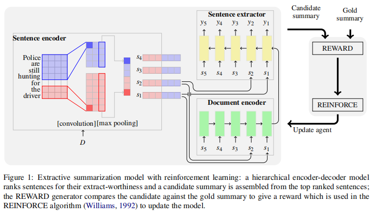

- 1. Introduction
  作者提到先前的抽取式摘要通常是将摘要任务当作二分类任务，即预测文本中的某一句话是否被选为摘要，通常使用交叉熵作为损失函数。作者认为交叉熵做训练并不是最佳的抽取式摘要的方法，用此种方式很容易产生冗长的摘要，包含很多不必要的信息。本文提出要全局优化ROUGE指标并通过强化学习的目标来对句子进行排序以生成摘要。
  2. Summarization as Sentence Ranking
  对于一个文档以及句子序列，模型首先为每个句子预测一个标签，其中标签1代表句子应该出现在摘要之中，接着模型学习为标签为1的句子分配一个分数，最后根据得分排序，取前个句子组成摘要。本文提出的模型包含三个模块：sentence encoder、document encoder、sentence extractor，模型结构如下所示：
- 
- 本节作者主要讨论了交叉熵损失对于抽取式摘要任务的缺点，有以下两个不符合：
- （1）第一个是任务定义与训练目标的脱节：极大似然估计旨在估计ground truth的似然，然而模型的任务为（a）对句子排名来抽取摘要；（b）使用ROUGE评估模型。
- （2）第二个是对于ground truth标签的依赖：训练的文本不是天生就带有标签的，都是通过从人工生成的摘要中推断而来的。对于标签的分配，有以下两种方式：
- （a）基于规则的方法，根据人工生成的摘要的语义为每个句子分配标签；
- （b）识别能够达到最优ROUGE指标的句子集合，为句子集合中的每个句子标注为1。
- 其中（a）方法会产生过多的标注为1的句子，容易导致模型过拟合，所以（b）方法是一个更好的选择，作者将其称为集体标签（collective labels）。
- 解决了句子标签的问题，作者阐述了为什么交叉熵损失不好，作者表明，在集体标签上，交叉熵损失只会考虑少量的标注为1的句子（只会极大化标注为1的句子的概率），因此很容易造成模型的欠拟合，作者认为在训练过程中，有很多ROUGE得分很高的句子也应该被考虑，而不仅仅考虑这些标注为1的句子。作者在下表中举了一个例子：
  本文采用的训练目标不是极大化似然函数，而是预测每个句子单一的ROUGE分数，然后取分数最高的m个句子组成摘要。但是分数最高的m个句子的组合并不一定是分数最高的摘要，因为可能会有几个ROUGE分数高的句子组合在一起后会造成大量的冗余。举例来看，商上表中的句子3有很高的ROUGE分数（35.6），但是前五个高分摘要中却没有句子3。作者将使用强化学习的方式来解决这个问题。
- 4. Sentence Ranking with Reinforcement Learning
  强化学习能够提升抽取式摘要的效果主要表现在以下两个方面：
- （1）能够直接优化验证时的评价指标；
- （2）能够更好的对句子进行判别，如果一个句子经常出现在高分摘要中，其排名相对会很高。
- 4.1 策略学习
  以强化学习的视角，模型可以看作是与一个文档组成的“环境”交互的“代理”。首先“代理”被随机初始化，对每个句子使用如下策略来预测相关分数：
- 当“代理”读过整篇文档后，一个带有标签的摘要会被抽取出来，作者采用ROUGE-1、ROUGE-2、ROUGE-L的平均F1 score作为“奖励”函数（其中，ROUGE-1、ROUGE-2用来评估信息量，ROUGE-L用来评估句子流畅度）：
- 极小化此函数可以看出，该目标是通过句子在高分摘要中出现的频率来学习句子是否应该摘要中出现。
- 注：强化学习是基于如下观察，不可微分的奖励函数的期望梯度可以由如下公式计算：
-
### 4.2 使用高概率样本进行训练

观察上述梯度公式，因为抽取句子的方式太多，故上述的期望求解很困难，故作者在此做了一个简化，通过一个单一样本来近似代替一个训练batch的期望梯度：
-
-
- 参考链接
# 对话摘要技术在美团的探索（SIGIR）
- https://mp.weixin.qq.com/s?__biz=MjM5NjQ5MTI5OA==&mid=2651768782&idx=2&sn=4fcb2039ba8717eafdb3a88c08045bb8&chksm=bd121e838a659795fc525938191765750ffc9907c2fda0a8c7770c8fbea6be8297f2fb7ca282&scene=27