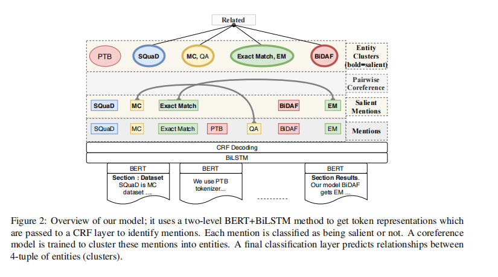

- Most structured extraction tasks from among these have revolved around extraction from sentences or abstracts of the articles
- Our dataset focuses on the task of identifying the main results of a scientific article
  as a tuple (Dataset, Metric, Task, Method) from raw text.
- It consists of three major subtasks,
	- identifying individual entities,还包括共指关系识别
	- their document level relationships,
	- predicting their saliency in the document (i.e., entities that take part in the results of the article and are not merely, for example, mentioned in Related Work).
- Our dataset is fully annotated with entities, their mentions, their coreferences,
  and their document level relations.
- we build a dataset of **438 fully annotated documents**
- 主要是计算机领域的论文
- 
- An input document D is represented as a list of sections
- We use pretrained contextualized token encodings using SciBERT over each section separately to get embeddings for tokens in that section
- If the section is bigger than 512 tokens (SciBERT limit),it is broken into 512 token subsections, and each subsection is encoded separately
- To allow document-level information flow, we concatenate the section-level token embeddings and add a BiLSTM on top of them.
- Mention Identification and Classification
	- Given token embeddings, our model applies a sequence tagger that identifies mentions and classifies their types. We train a BIOUL based CRF tagger on top of the BERT-BiLSTM embeddings of words to predict mention spans mj and their corresponding types
-