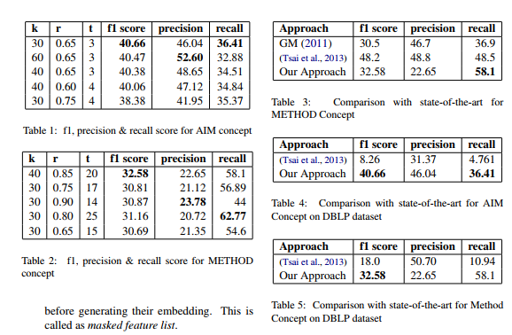

- We extract the fundamental concepts of **aim, method and result** from scientific articles and use them to construct a knowledge graph他这篇文章也是抽了三种实体，抽的时候也是以片段的形式抽取出来
- 用到的文本是标题和摘要还有引用出的context，也就是别人是怎么描述这篇文章的
- 下面这句话解释了他为什么要用到引用的context
- Our main insight is that a paper cites another paper either for its aim, or method, or result.
- 他把这个抽取之后的片段加到了论文引用网络中作为一个节点，也就是说每篇论文会连接三个短语实体
-
  >问题定义
- Given a target document d, the objective of the concept extraction task is to extract a list of words or phrases which best represent the aim, method and result of document d
- 以前的研究倾向于把这个问题建模成序列标注问题，但是因为缺乏训练语料，他对于这个抽取问题给他建模成了句子分类问题，灵感来源于下面这句话
- Since we already have a defined set of candidates for the key phrases, we attempt this problem as multiclass classification problem.
- To capture this semantic similarity, we use k nearest neighbour classifier on top of state-of-the-art domain based word embeddings. We start by extracting features from a small set of annotated examples and used bootstrapping for extracting new features from unlabeled dataset
-
-
-
  >验证的数据集
- 他使用的数据集DBLP
- All the experiments were conducted on **DBLP Citation Network**
- This dataset is an extensive collection of computer science papers. DBLP only provides
  citation-link information, abstract, and paper titles. For the full text of these papers, we use the same dataset as have been used by (Ganguly and Pudi, 2017).
-
-
- We present a case study on the computational linguistics community and computer vision community using the three concepts extracted from its articles, for verifying the results of our system and for showing domain independence of our approach
-
-
-
- 
- 从上图可以看出目前的抽取效果还是很差的
-
-
-