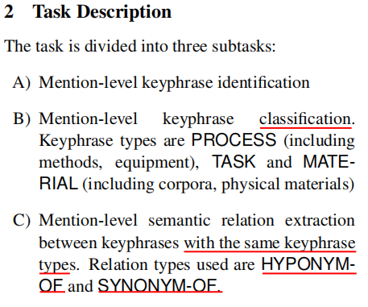

title:: SemEval 2017 Task 10: ScienceIE - Extracting Keyphrases and Relations from Scientific Publications

- For this purpose, a double-annotated corpus of 500 publications with mention-level annotations was produced, consisting of scientific articles of the Computer Science, Material Sciences and Physics domains.这个数据集是标注了三个领域计算机科学，材料科学，物理科学
- **Each data instance consists of one paragraph of text**, drawn from a scientific paper. We therefore only annotate paragraphs of publications likely to contain relations.提供了全文，但是每个文章只标注了一个段落
- **500 paragraphs** from journal articles evenly distributed among the domains Computer Science, Material Sciences and Physics were selected.
- 