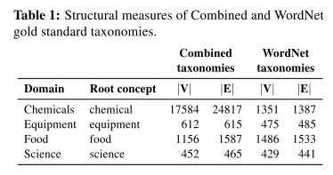

title:: SemEval-2015 Task 17: Taxonomy Extraction Evaluation (TExEval)

- Taxonomy learning can be divided into three main subtasks: term extraction, relation discovery, and taxonomy construction
- 他的任务主要聚焦于后两个阶段即关系抽取和本体构建，他首先提供了很多的词汇，然后并没有提供大量的关系抽取基于的文本，然后就这样让你自己去找文本抽关系构建有向无环本体树
-
-
  >数据
- We selected four target domains with a rich, deep, hierarchical structure (i.e. Chemicals, Equipment, Food and Science) with four root concepts (i.e. chemical, equipment, food and science, respectively). Then, for each domain we produced two kinds of gold standard taxonomies.
- 
- **WordNet taxonomy** Concepts and relationships in the WordNet hypernym-hyponym hierarchy rooted on the corresponding root concept.
- Combined taxonomy Domain-specific terms and relations from well-known, publicly available, taxonomies other than WordNet:
	- CheBI1 for Chemicals,
	- “The Google product taxonomy”2 for Foods,
	- the “Material Handling Equipment”3 taxonomy for Equipment,
	- and the “Taxonomy of Fields and their Subfields”4 for Science.
- Hypernym-hyponym relationships were also gathered from a general purpose resource, the Wikipedia Bitaxonomy (WiBi) (Flati et al., 2014), using a semi-automatic approach. For each domain we first manually identified domain sub-hierarchies from WiBi (W); S
-