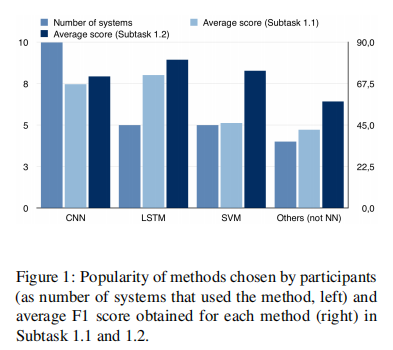

title:: Semeval 2018 task 7: Semantic relation extraction and classification in Scientific papers

- 分成了三个子任务
- 给定人工标注实体，和标注好的关系，预测关系类型
- 给定自动标注的实体，和标注好的关系，预测关系类型
- 给定人工标注的实体，预测关系，预测关系类型，就是先确定实体对On the textual level, a
  semantic relation is conceived as a text span linking two annotated instances of concepts within the same sentence
- We also presented the dataset used for the challenge: a subset of abstracts of published papers in the ACL Anthology Reference Corpus, annotated for domain specific entities and semantic relations
- 只是用了abstract部分的数据，标注里面的 entity 并对entity的关系进行分类，定义了以下6种类型的实体关系
- 
- The work was divided as
	- 1) defining the typology(类型) of semantic relations,
	- 2) validation of the typology and of the annotation guidelines and
	- 3) annotation.
	- A data-driven approach was adopted to identify the relation types and define a typology (G´abor et al.,2016b).
- 标注数据集中的文献全是NLP领域的文献
- 
- The results show that while good results can be obtained on the supervised multi-class classification of relation instances, the extraction of such instances remains very challenging.
-
-
-
-