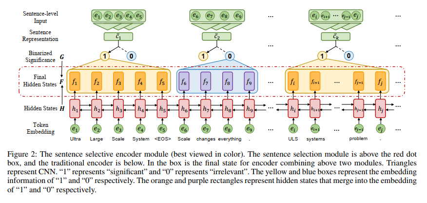

- 
- 他这里面也用到了sentence selector
- 这篇文章解决的问题是关键短语生成
- 他把这个问题分为了2步，第一步是选择用于生成关键短语的句子，第二步是根据上一步选出的句子生成关键短语
- 具体包括两个模块，senetence selective encoder和decoder
- 在训练这个不连续的网络的时候，作者并没有使用策略梯度，而是使用了参考下面两篇论文的直通量**straight-through estimator**
-
- [[Deep Learning as a Mixed  Convex combinatorial Optimization Problem]]
-
-
-
-
-
-
-
-
-
-
- STE解释文章参考链接
- https://blog.csdn.net/u013289254/article/details/119389033
-
-
- training discontinuous networks提到的两篇文献
- [[estimating or propagating gradients through stochastic neurons for conditional computation]]
- [[Binarized nerual netowrks: Training deep neural networks with weights and activations constrained to +1 or -1]]