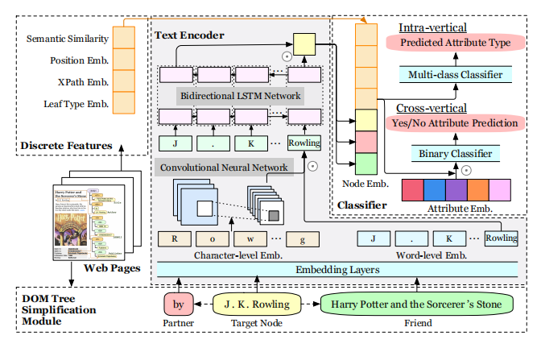
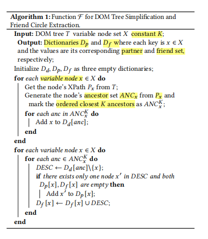
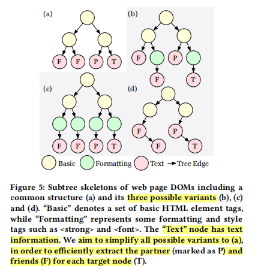
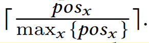
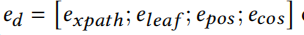

- 
- 代码：https://github.com/google-research/google-research/tree/master/simpdom
- https://github.com/MurtuzaBohra/SimpDOM
- The node encoder consists of three components:
	- DOM tree simplification module,
	- text encoder
	- discrete feature module.
-
  >**DOM tree simplification module**
	- extract the contexts for each variable node,  composed of **partner** and **friends**
	- 
	- 在抽取friends节点和parter节点时，我们首先需要对原始的文档做一些简化，去除掉一些只表示格式的节点
	- In the extraction process, we keep all the basic HTML element tags like <tr> and <td> while remove the formatting and style tags such as <strong> and 
	- 
-
  background-color:: #264c9b
	- By limiting the size of **𝐾**, we can narrow down the search area in the tree such that the noisy textual features from distant branches can be efficiently trimmed,
-
  >**Text encoder**
	- We employ a **hierarchical LSTM-CNN text encoder** to encode the character-level and wordlevel features.
-
  >**Discrete Feature Module**
	- Xpath embeddings
		- We learn a separate bi-directional LSTM to get the dense representation _**Expath**_ of dimension 𝑑𝑥𝑝𝑎𝑡ℎ for each XPath sequence
	- Leaf node type embeddings
		- We collect the vocabulary set of the HTML tags and randomly initialize an embedding 𝑒𝑙𝑒𝑎 𝑓 of dimension 𝑑𝑙𝑒𝑎 𝑓 for each of them
	- Position embeddings
		- We apply depth-first-search to traverse the tree and get the occurrence position 𝑝𝑜𝑠𝑥 of each node
		- Then we compute its relative position via
		- 
		-
	- Semantic similarity
		- we compute the **cosine similarity** between the **partner embedding** 𝑒𝑝 and each **attribute embedding** 𝑒𝑎𝑖 to model their semantic relations, which results in a semantic similarity vector 𝑒𝑐𝑜𝑠 of dimension 𝑀, where 𝑀 denotes the number of pre-defined attribute types
	- We concatenate them into a vector
		- 
-
  >node embedding is connected to a multi-layer perceptron (MLP) for multi-class classification