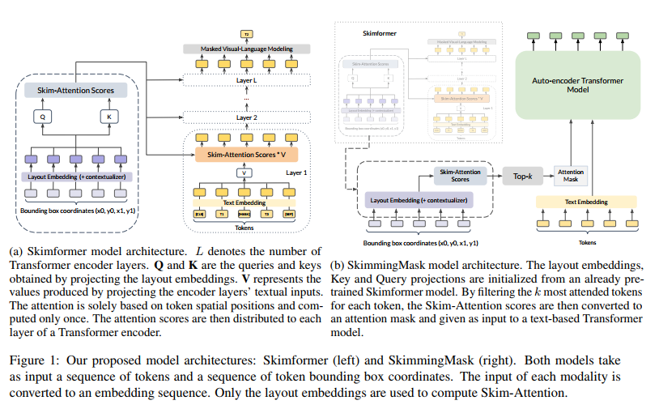
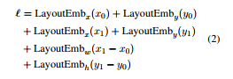
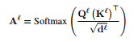

- 这篇文章最大的特点就是基于二维坐标位置来计算字符间的注意力
- 不是基于字符间的语义来计算注意力得分
- 他这个注意力得分计算完之后，后面的self-attention层就不会再重新计算attention了
- 他提出了两种把skim-attention融入bert类结构的方式
- 这篇文章中的数据集
	- DocBank
		- 500k english document pages from **arxiv.com** with different disciplenery
	- RVL-CDIP
		- 400k scanned document images from various categories
	- PubLayNet
		- cover 360 thousand document images from **PubMed**
- document layout analysis
- https://github.com/recitalAI/skim-attention
- 
- Four embedding tables are used to encode spatial positions: two for the coordinate
  axes (x and y), and the other two for the bounding box size (width and height).
- 
-
  >skip attention
- Formally, let $\mathbf{x}^{\ell}=\left\{\ell_0, \ell_1, \ldots, \ell_n\right\}$ be an input sequence of layout embeddings, and $Q^{\ell}=$ $\mathbf{W}_q^{\ell} \mathbf{x}^{\ell}, \mathbf{K}^{\ell}=\mathbf{W}_k^{\ell} \mathbf{X}^{\ell}$, the Queries and Keys obtained by linear transformations of the layout embeddings. For a single attention head, the SkimAttention matrix is defined by:
- 
-
  >skipformer
	- The model adopts a two-step approach: first, the skim-attention scores are computed once and only once using layout information alone; then, these attentions are used in every layer of a Transformer encoder.
- As opposed to BERT, we do not encode sequential positions into the text embeddings.
-
-
-
-