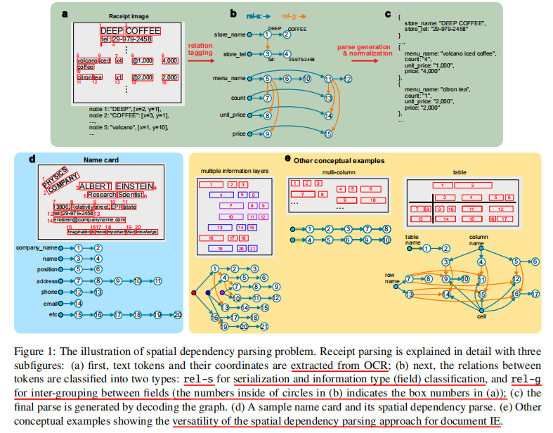

- {:height 559, :width 704}
- SPADE consists of
- (1)spatial text encoder,(2) graph generator, (3)graph decoder.
- Spatial text encoder and graph generator are trained jointly. Graph decoder is a deterministic function (without trainable parameters)
-
  >Spatial text encoder
- 这个也是基于transformer的encoder框 架，然后计算attentiond的时候用了空间位置编码
-
  >Graph Generator
- 这个比较有意思，他是把属性抽取转换成了边的预测问题，如果某个text token 和那个field node相连，那说明这个text是属于这个field node的，这样就构成了预测
- https://github.com/clovaai/spade