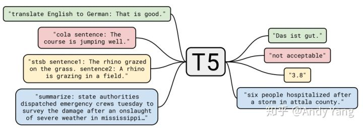
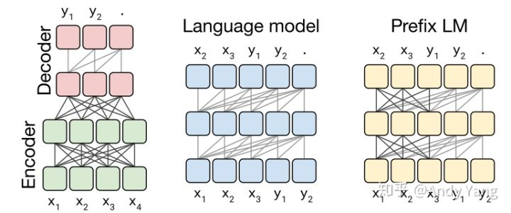
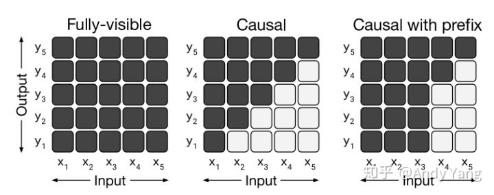
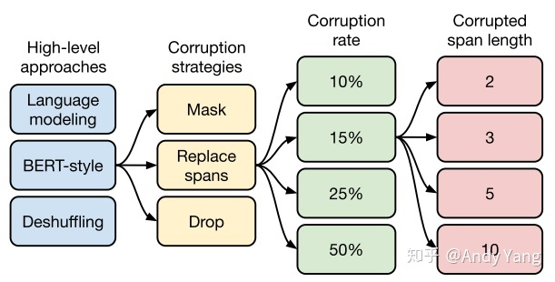
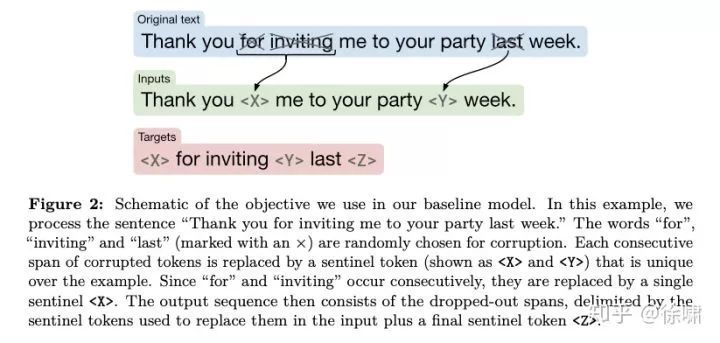
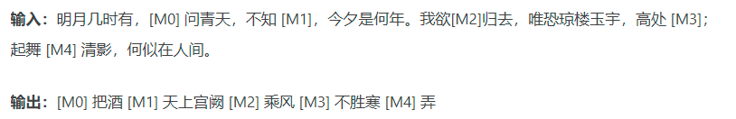
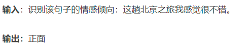

- 原论文：Exploring the Limits of Transfer Learning with a Unified Text-to-Text Transformer
- 其中 idea 创新也不大，它最重要作用是给整个 NLP 预训练模型领域提供了一个通用框架，把所有任务都转化成一种形式。
- introducing a unified framework that converts every language problem into a text-to-text format.
-
- T5 模型，因为是 Transfer Text-to-Text Transformer 的简写，和 XLNet 一样也不在芝麻街玩了
- 将所有 NLP 任务都转化成 Text-to-Text （文本到文本）任务。
- 
- 之后未来做 NLP 实验时，可能就不再是自己怎么调一些模型了，而是无论什么任务，直接拿来一个超大预训练模型，然后主要工作就变成了怎么把任务转换成合适的文本输入输出
- 举几个例子就明白了，比如英德翻译，只需将训练数据集的输入部分前加上“translate English to German（给我从英语翻译成德语）” 就行。假设需要翻译"That is good"，那么先转换成 "translate English to German：That is good." 输入模型，之后就可以直接输出德语翻译 “Das ist gut.”
- 再比如情感分类任务，输入"sentiment：This movie is terrible!"，前面直接加上 “sentiment：”，然后就能输出结果“negative（负面）”。
-
  >Architecture：The Best One
- 首先作者们先对预训练模型中的多种模型架构（Transformer）进行了比对，最主要的模型架构可以分成下面三种。
- 
- 上面这些模型架构都是 Transformer 构成，之所以有这些变换，主要是对其中注意力机制的 Mask 操作。
- 
- 通过实验作者们发现，在提出的这个 Text-to-Text 架构中，Encoder-Decoder 模型效果最好。于是乎，就把它定为 T5 模型，因此所谓的 T5 模型其实就是个 Transformer 的 Encoder-Decoder 模型。
- 本文研究的所有模型均基于 Transformer 架构。需要注意的是，Transformer 使用正余弦函数的位置编码，BERT 使用的是学习到的位置嵌入，而本文使用的是相对位置嵌入。
-
  >预训练目标Objectives：Search，Search，Search
- 之后是对预训练目标的大范围探索，具体做了哪些实验，下面这张图就能一目了然。
- 
- 第一个方面，高层次方法（自监督的预训练方法）对比，总共三种方式。
	- 语言模型式，就是 GPT-2 那种方式，从左到右预测；
	- BERT-style 式，就是像 BERT 一样将一部分给破坏掉，然后还原出来；
	- Deshuffling （顺序还原）式，就是将文本打乱，然后还原出来。
- 其中发现 Bert-style 最好，进入下一轮。
- 第二方面，对文本一部分进行破坏时的策略
- 第三方面，到底该对文本百分之多少进行破坏呢
- 第四方面，因为 Replace Span 需要决定对大概多长的小段进行破坏
- 终于获得了完整的 T5 模型，还有它的训练方法。
- Transformer Encoder-Decoder 模型；
	- BERT-style 式的破坏方法；
	- Replace Span 的破坏策略；
	- 15 %的破坏比；
	- 3 的破坏时小段长度。
- 
- T5 的预训练包含无监督和有监督两部分。无监督部分使用的是 Google 构建的近 800G 的语料（论文称之为 C4），而训练目标则跟 BERT 类似，只不过改成了 Seq2Seq 版本，我们可以将它看成一个高级版的完形填空问题
- 
- 而有监督部分，则是收集了常见的 NLP 监督任务数据，并也统一转化为 SeqSeq 任务来训练。比如情感分类可以这样转化：
- 
-
-
  >Fine-tuning methods
- 有人认为，微调模型的所有参数可能会导致结果欠佳，尤其是在资源匮乏的情况下。文本分类任务的迁移学习的早期结果提倡仅微调小型分类器的参数.我们专注于两种替代的微调方法，这些方法仅更新编码器-解码器模型的参数的子集。
- 第一种：“adapter layers”[15]的动机是在微调时保持大多数原始模型固定不变。适配器层是附加的dense-ReLU-dense块，这些块在变压器的每个块中的每个预先存在的前馈网络之后添加
- 第二种替代性微调方法是“gradual unfreezing”[6]。在逐步解冻过程中，随着时间的流逝，越来越多的模型参数会进行微调。逐步解冻最初应用于包含单个块层(a single stack of layers)的语言模型体系结构。
-
-
-
-
- 参考网页
- https://www.jiqizhixin.com/articles/2020-11-17-3
- https://zhuanlan.zhihu.com/p/88438851