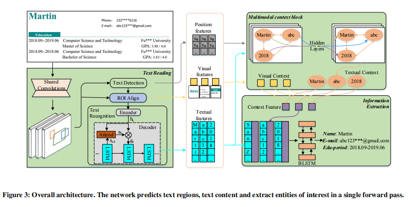

title:: TRIE: End-to-End Text Reading and Information Extraction for Document Understanding

- , (1) text reading for detecting and recognizing texts in the images
- (2) information extraction for analyzing and extracting key elements from previously
  extracted plain text
-
- 代码
- https://github.com/hikopensource/DAVAR-Lab-OCR/tree/main/demo/text_ie/trie
- 这篇文章是将这两个任务集成起来做成end to end的形式，输入就是一张图片，输出是自己感兴趣的信息field,从ocr开始，文字识别，文字检测都有
- 
- It mainly consists of three parts:text reading module, multimodal context block and
  information extraction module
- Text reading module is responsible for localizing and recognizing all the texts in the document image and information extraction module is to extract entities of interest
  from them. The multimodal context block is novelly designed to bridge the text reading and information extraction modules.