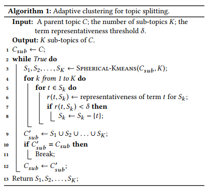
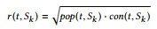
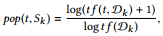
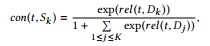

title:: TaxoGen: Unsupervised Topic Taxonomy Construction by Adaptive Term Embedding and Clustering

-
- 首先是拿到一个文章集合，还有一个待聚类的词的集合
- 这篇文章的目的是给定一个粗糙的大的topic要把他细化，延伸出更小的topic
- 第一步是先训练词向量，然后聚类，聚类的方法是spherical k-means聚类
- 这个聚类算法基于的距离是cosine similarity，和最基本那种k-means不太一样
- 
- 他这个聚类最大的特点就是会把哪些较通用的词给剔除掉，因为他发现有些词并不是特别属于某个subtopic，他是描述了这个整体的，allocate different term to different levels
-
  >Measuring term representativeness
	- 为了去除每个子类别中那种通用性较强的上位词，他设计了一个指标，这个指标会在每个类别中的每个词精心计算，小于该指标的即认为是通用词，即在后续的迭代步骤中去除该词
	- 这个指标的计算方式如下
		- 他首先会针对每个子主题，收集关于这个子主题的文档$D_k$
		- Popularity: A representative term for $S_k$ should appear frequently in the documents of $S_k$.
		- Concentration: A representative term for $S_k$ should be much more relevant to $S_k$ compared to the sibling topics of $S_k$
	- 
	- normalized frequency of t in $D_k$
	- 
	- 这个公式衡量的是一个词和一个文档的相关程度，底下有一个归一化指数，类似于tf-idf的计算
	- 
-
  >Local embedding
	- 对于这一步，他是发现，对于taxnomy的所有层，如果只训练一次embedding的话，在第一层聚类的时候比较好用，后面层聚类的时候就不太好用了，所有对于taxnomy的不同层级他是会重新训练一个local embedding，gobal embedding对于最上层的 聚类好使，对于下层的聚类就很难区分开更新的子类了，
	- 对于每一层级，他会为每个子topic重新挑选一个属于该topic的语料文章集合，然后在这个子语料上训练local embedding,这个挑选子语料的方式也比较随意，他原文中是提出了两种，这两种主要都是使用tf-idf指标
	- clustering-based
	- retrieval-based
-
  >实验部分
	- We use two datasets in our experiments: (1) DBLP contains around 1,889,656 titles of computer science papers from the areas of information retrieval, computer vision, robotics, security & network, and machine learning. From those paper titles, we use an existing NP chunker to extract all the noun phrases and then remove infrequent ones to form the term set, resulting in 13,345 distinct terms;
	- (2) SP contains 94,476 paper abstracts from the area of signal processing. Similarly, we extract all the noun phrases in those abstracts to form the term set and obtain 6,982
	  different terms
-